# Руководство по подготовке к ЕГЭ по информатике 2026

Разбор номеров, актуальных способов решения, подводных камней, частых ошибок. Практические задачи из реальных ЕГЭ прошлых лет.

Если есть пожелания по разбору определенных задач/способов решения/нашли очепятку/ошибку или просто хотите выразить респект: kirill.kolodkin1505@gmail.com.

# Оглавление

[Задача 1](#task1) (Графы) ([практика](./tasks/task1.md))

[Задача 2](#task2) (Логические выражения) ([практика](./tasks/task2.md))

[Задача 3](#task3) (Электронные таблицы. Базы данных) ([практика](./tasks/task3.md))

[Задача 4](#task4) (Кодирование информации. Условие Фано) ([практика](./tasks/task4.md))

[Задача 5](#task5) (Программирование. Простейшие алгоритмы) ([практика](./tasks/task5.md))

[Задача 6](#task6) (Черепаха) ([практика](./tasks/task6.md))

[Задача 7](#task7) (Кодирование информации. Графика, аудио) ([практика](./tasks/task7.md))

[Задача 8](#task8) (Программирование. Комбинаторика) ([практика](./tasks/task8.md))

[Задача 9](#task9) (Электронные таблицы) ([практика](./tasks/task9.md))

[Задача 10](#task10) (Текстовый редактор. Поиск информации в тексте) ([практика](./tasks/task10.md))

[Задача 11](#task11) (Кодирование информации. Текст) ([практика](./tasks/task11.md))

[Задача 13](#task13) (Сети) ([практика](./tasks/task13.md))

[Задача 14](#task14) (Операции в различных СС) ([практика](./tasks/task14.md))

[Задача 15](#task15) (Истинность логического выражения) ([практика](./tasks/task15.md))

[Задача 16](#task16) (Рекурсия) ([практика](./tasks/task16.md))

[Задача 17](#task17) (Обработка целочисленной последовательности) ([практика](./tasks/task17.md))

# <a id="task1">Задача 1 </a>

В данном типе задач на примере схемы дорог и их протяженности мы взаимодействуем с такими понятиями, как:

1. Граф - схема дорог.
2. Вершина - населенный пункт.
3. Ребро - дорога.
4. Степень вершины - количество выходящих из нее ребер (дорог).
5. Матрица смежности - таблица с номерами пунктов.

Обычно в задаче требуется определить длину дороги или сумму длин нескольких дорог, или же соотнести номера пунктов из таблицы с вершинами графа. 

## Решим задачу из демоверсии 2026

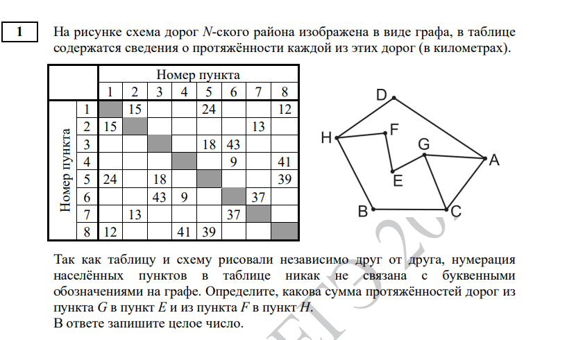

### Алгоритм решения
Решение всех задач этого типа начинается с проставления степеней вершин.

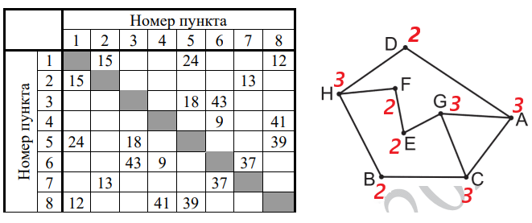

В самом простом случае уже на этом этапе получится однозначно выделить вершину с неповторяющейся степенью. В данном случае у нас таких вершин нет (т.к. 5 вершин имеют степень 3 и 3 вершины степень 2). Тогда начинаем анализировать связи между вершинами.

Последовательно изучив все вершины, мы можем сделать вывод, что вершина H - единственная вершина 3 степени, которая связана с двумя вершинами второй степени (все остальные вершины степени 3, а именно A, B, C, G связаны с вершинами, имеющими степени 3, 3 и 2 ). Следовательно, если в таблице (матрице смежности) мы найдем такой номер пункта 3 степени, ведущий в пункты со степенями 2, 2 и 2, то сможем однозначно соотнести номер пункта и вершину графа. Таким пунктом оказывается пункт с номером 6. 

Далее анализируем вершины смежные H, а именно D, F, B. Вершина D связана с вершинами A(3) и H(3), B c H(3) и C(3), а F c H(3) и E(2) Таким образом, вершина F определяется однозначно, так как это единственная вершина, смежная с вершиной степени 2. Посмотрев на таблицу, определяем F как пункт 7. 

Далее из F легко определяется E, как пункт 2 (так как из F есть путь в H, который нам известен и в другой пункт, следовательно этот пункт и есть E). По такому же принципу определяется и вершина G, как пункт 1.

 Далее нам необходимо посмотреть по матрице смежности длины из П6 в П7 и из П1 в П2, соответствующие FH и GE и равные 37 и 15. Находим их сумму, 37 + 15 = 52. Это и есть ответ к задаче.

## Решим задачу из досрока 2024 года

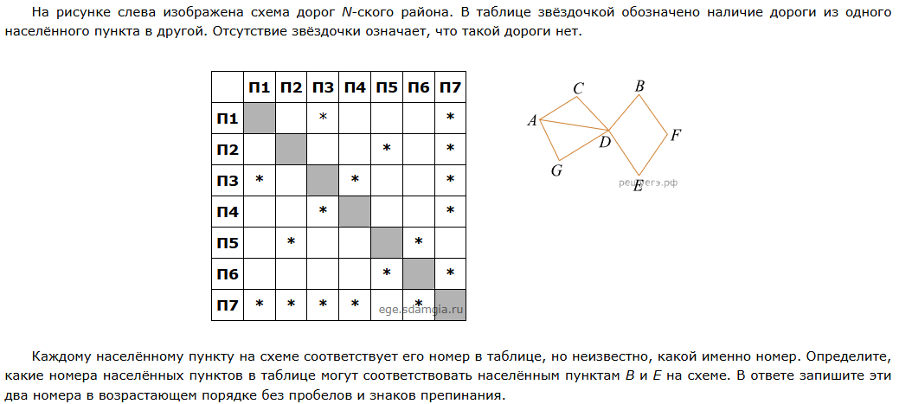

В данном подтипе задач от нас требуется лишь установить соответствие номеров пунктов и вершин графа. Обратим внимание, что вершина D определяется однозначно как пункт 7, как единственная вершина, имеющая степень 5. Далее мы можем однозначно определить вершину F(пункт 5), так как она единственная не связана с уже определенной D. Проанализировав связи F, можно сделать вывод что вершинам B и Е соответствуют пункты 2 и 6. Однако однозначного соответствия между данными пунктами и вершинами мы выявить не сможем. Но этого и не требуется по условию задачи. Ответ: 26.

## На что обратить внимание
Не всегда в задаче возможно однозначно соотнести все пункты матрицы смежности и вершин графа. Однако, зачастую это и не нужно. В первую очередь всегда стоит обращать внимание на то, какой путь (или пути) нам требуется найти по условию.

## А знаете ли вы что?

Задачу можно решить программным способом. Не рекомендуется так делать на экзамене, так как код имеет довольно сложный синтаксис и в нем легко ошибиться, если нет четкого понимания алгоритма работы программы. Код для решения задачи из демоверсии будет выглядеть так:

```python
from itertools import *

table_str = '1258 217 356 468 5138 6347 726 8145'
graph_str = 'ADGC BHC CAGB DAH EFG FHE GACE HBDF'

result_graph = {x[0]:set(x[1:]) for x in graph_str.split()}

for p in permutations("ABCDEFGH"):
    curr = table_str
    for number, letter in zip('12345678', p):
        curr = curr.replace(number, letter)
    curr_graph = {x[0]:set(x[1:]) for x in curr.split()}
    if result_graph == curr_graph:
        print('1 2 3 4 5 6 7 8')
        print(*p)
```

### Разбор решения

1. Переписываем данные из таблицы, какой пункт связан с каким (1258 - первый с 2, 5, 8, 217 - второй с 1, 7 итд) в переменную table_str.
2. Проделываем аналогичные действия с буквами вершин графа, сохраняя связи в переменную graph_str.
3. Создаем из строки словарь, где ключами будут выступать названия вершин от A до H, а значениями - множество связанных с ними вершин. Это наш эталонный граф, с которым мы будем сверять остальные, сохраняем его в переменную result_graph. По итогу, она будет иметь следующий вид:
   
```python
{'A': {'C', 'G', 'D'}, 'B': {'C', 'H'}, 'C': {'G', 'B', 'A'}, 'D': {'A', 'H'}, 'E': {'G', 'F'}, 'F': {'E', 'H'}, 'G': {'C', 'A', 'E'}, 'H': {'B', 'F', 'D'}}
```

4. Далее перебираем все возможные перестановки букв в строке "ABCDEFGH".
5. Берем числовое соответствие номеров пунктов из таблицы, которое хранится в table_str, заменяем цифры на соответствующие буквы (в зависимости от текущей перестановки) и переводим получившуюся строку в словарь, где ключами будут названия вершин, а значениями - множественно связанных с ними вершин. Например, если текущая перестановка равна "FHABCEDG", то 1 заменится на F, 2 на H и т.д.
6. Далее происходит сравнение с эталонным графом result_graph, если текущий граф равен эталонному (т.е. из условия задачи), то выводим на экран соответствия номеров пунктов буквам вершин графа.
7. Таким образом, на экране мы увидим все возможные правильные сопоставления номеров пунктов с вершинами графа. Далее останется лишь подсчитать сумму дорог, она будет одинаковой для любого варианта. 

# <a id="task2">Задача 2 </a>

В данной задаче нам требуется построить таблицу истинности результата определенного логического выражения и сопоставить ее с таблицей истинности из условия, чтобы определить какому столбцу соответствует какая переменная.

## Важно знать 

### Реализация логических операций в python

1. ∧ (конъюнкция, логическое И) - and.
2. ∨ (дизъюнкция, логическое ИЛИ) - or.
3. ¬ (отрицание, логическое НЕ) - not.
4. ≡ (тождество, эквивалентность) - ==.
5. → (следование, импликация) - <=.

### Приоритеты операций (по убыванию)

1. ==, <=
2. not
3. and
4. or

## Решим задачу из демоверсии 2026

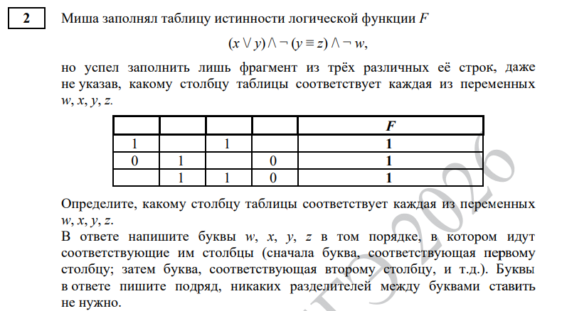

Напишем код, который переберет все возможные значения x, y, w, z и выведет нам на экран лишь те, при которых наша функция принимает значение 1 (или 0, в зависимости от условия задачи).

### Код

```python
print("x y w z")
for x in range(2):
    for y in range(2):
        for w in range(2):
            for z in range(2):
                f = (x or y) and ((not y) == z) and (not w)
                if f == 1: # тут может быть 0, в зависимости от условия задачи
                    print(x, y, w, z)
```

Получаем результат

| x | y | w | z |
|---|---|---|---|
|0|1|0|0|
|1|0|0|1|
|1|1|0|0|

Обратим внимание, что в столбце w только нули. При этом, если внимательно посмотреть на таблицу в условии, легко заметить, что все нули могут быть только в последнем (четвертом) столбце. Значит мы точно определили положение w. 

Меняем первую строчку на print("x y z w"), а последнюю соответственно на print(x, y, z, w), перезапускаем программу.

| x | y | z | w |
|---|---|---|---|
|0|1|0|0|
|1|0|1|0|
|1|1|0|0|


Обратим внимание, что в столбце z у нас лишь 1 единица, при этом в таблице из условия такой столбец может быть лишь под номером 1 (еще может быть 4ый, но его мы уже однозначно определили для w, поэтому не учитываем). 

Меняем первую строчку на print("y x z w"), а последнюю соответственно на print(y, x, z, w), перезапускаем программу.

| z | y | x | w |
|---|---|---|---|
|0|1|0|0|
|1|0|1|0|
|0|1|1|0|

Проверим строки на соответствие. Нашей первой строке (0100) соответствует вторая строка таблицы из условия, вторая строка результата нашей программы (1010) соответствует первой строке таблицы, а третья (0110) - третьей. Таким образом, все строки совпали, противоречий не обнаружено - следовательно, найдено верное соответствие. Ответ: zyxw.

## На что обратить внимание
1. Лучше заключать операции в скобки, чтобы не напутать с порядком выполнения операций (а сравнение вида x == not y вообще выдаст ошибку).
2. После изменения порядка вывода переменных в print(), не забыть поменять порядок в первой строке программы.
3. Не забываем, что в таблице из условия не только столбцы перепутаны местами, но и строки тоже. 

## А можно ли решить руками?
Конечно! Как правило, по условию задачи, даны 4 операнда (x, y, w, z), значит общее количество всех перестановок будет равно $2 ^ 4 = 16$. 

Для того, чтобы не считать вручную все 16 вариантов, посмотрим внимательно на функцию. Сначала выполнятся операции в скобках, затем логическое НЕ (отрицание) и в конце 2 операции логического И. Как мы знаем, если хотя бы один из операндов логического И равен 0, то и все выражение будет равняться 0. 

Т.е. мы можем сразу проставить результат 0, если выполняется хотя бы одно из следующих условий:

1. w == 1 
2. y == z 
3. x == 0 and y == 0

Таким образом, посчитать полностью выражение нам необходимо лишь для 3х из 16 случаев. 

| x | y | w | z | F |
|---|---|---|---|---|
|0|0|0|0|0|
|0|0|0|1|0|
|0|0|1|0|0|
|0|0|1|1|0|
|0|1|0|0|1|
|0|1|0|1|0|
|0|1|1|0|0|
|0|1|1|1|0|
|1|0|0|0|0|
|1|0|0|1|1|
|1|0|1|0|0|
|1|0|1|1|0|
|1|1|0|0|1|
|1|1|0|1|0|
|1|1|1|0|0|
|1|1|1|1|0|

Далее ищем соответствия так же, как и в случае решения программированием. 

## Минусы ручного решения
1. Повышается вероятность ошибки, особенно если знание таблиц истинности оставляет желать лучшего.
2. Медленнее, особенно если не упрощать выражение, а считать все 16 вариантов "в лоб".


## А можно ли решить полностью программированием, без ручного сопоставления?
Можно. Однако код получается довольно сложным. Решим этим способом задание из демоверсии.

```python
from itertools import *

def f(x, y, w, z):
    return (x or y) and (not(y == z)) and (not w)

for a in product([0, 1], repeat=4):
    table = [(1, a[0], 1, a[1]), (0, 1, a[2], 0), (a[3], 1, 1, 0)]
    if len(table) == len(set(table)):  
        for p in permutations('xywz'):
            if [f(**dict(zip(p, r))) for r in table] == [1, 1, 1]:
                print(p)
```
### Разбор решения

1. Запишем в отдельную функцию f(...) функцию из условия.
2. Будем перебирать все возможные комбинации 0 и 1 в пустующих ячейках таблицы, так как у нас таких ячеек 4, то в repeat мы указываем 4. 
3. Формируем таблицу на основе таблицы из условия, пустоты заполняем соответствующими значениями a[0]...a[3].
4. Проверяем, что в получившейся таблице нет повторяющихся строк (по условия задачи)
5. Перебираем все возможные перестановки букв в строке "xywz".
6. Сопоставляем значениям текущей перестановки со значениями 0 и 1 из сформированной ранее таблицы и проверяем, что функция f(), примененная к этим данным будет всегда истина - т.е. вернет 3 строки со значениями 1 (3, так как в таблице из условия дано 3 строки).
7. Если условие истинно - выводим на экран верную перестановку, которая и будет ответом к задаче.


# <a id="task3">Задача 3 </a>
Задача на имитацию работы с базой данных. Как правило, нам предлагается 3 таблицы, каждая на отдельном листе электронной таблицы: "Движение товара", "Товар" И "Магазин". Связь между таблицами осуществляется по т.н. "ключу" - id магазина и артикулу товара. 

## Решим задачу из демоверсии 2026

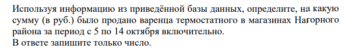

Сначала найдем номера (id) необходимых нам магазинов. Переходим на лист "Магазин". Применяем автофильтр (Данные -> Автофильтр или Ctrl+Shift+L). Фильтруем район.

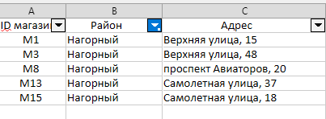

Далее найдем нужный нам артикул товара. Перейдем на лист "Товар", используем автофильтр и ищем нужный нам товар. Также обращаем внимание на его стоимость (76 руб).

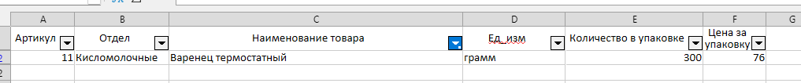

Возвращаемся на лист "Движение товара" и с помощью автофильтра фильтруем необходимые нам данные. Даты (7 - 14 окт), id магазина (1, 3, 8, 13, 15), Артикул (11), Тип операции (Продажа).

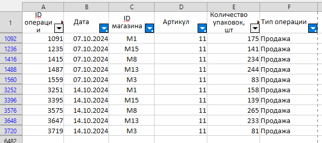

Далее важный момент, чтобы формулы работали корректно с получившимися данными, нужно скопировать и перенести результаты фильтрации на новый лист (иначе функции будут учитывать и скрытые столбцы, которые не подходят условиям фильтров). Затем суммируем столбец "Количество упаковок" и умножаем на стоимость (76 руб), получая ответ на задачу.

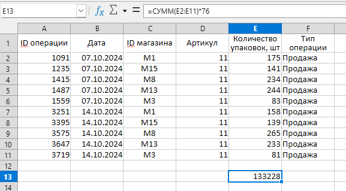

Данное решение может не сработать в тех случаях, когда номеров магазинов или артикулов товаров очень много (сотни или тысячи), чтобы вручную не переносить их значения в соответствующие фильтры, используем функцию ВПР - вертикальный просмотр. 

На листе "Движение товара", добавим столбец "Район" и напишем формулу 

**=ВПР(C2;$Магазин.A:C;2;0)**

Первый аргумент - id, номер, по которому мы связываем данные между таблицами, т.е. id магазина в данном случае, второй аргумент - это диапазон поиска данных, переходим на лист "Магазин" и выделяем всю таблицу, третий аргумент - это номер столбца, который мы хотим видеть в исходной таблице, поскольку мы хотим видеть название района, а он располагается в столбце B листа "Магазин", т.е. во втором столбце, то ставим 2, последний аргумент всегда будет 0.

По аналогии с районом, перенесем в основную таблицу и артикулы товаров. Итоговая формула:

**=ВПР(D2;$Товар.A:F;3;0)**

Дальнейшее решение аналогично разобранному выше.

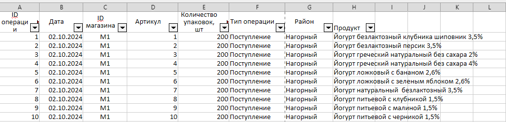

## На что обратить внимание

1. После итоговой фильтрации не забываем копировать результаты на отдельный лист.
2. Знать и уметь применять функцию ВПР.

# <a id="task4">Задача 4 </a>

В данной задаче нам, как правило, требуется определить минимально возможный код (двоичный) для символов некоторого алфавита. При этом код этот должен не нарушать т.н. условие Фано, т.е. определяться однозначно.

Рассмотрим на примере. Если нам требуется закодировать алфавит, состоящий всего из 2х символов (например букв А и Б), мы можем выбрать для буквы А код 0, а для Б 1 (или наоборот, это несущественно). Однако если мы захотим также выбрать код для третьего символа, например для буквы В, задача окажется нерешаемой. Ведь если мы выберем, к примеру, 11, то получатель нашего сообщения не сможет однозначно определить, что мы имели ввиду, букву В или же 2 буквы Б подряд.

Чтобы решить эту задачу, мы можем переназначить букве Б код 10, а букве В 11, соответственно. 

## Решим задачу из демоверсии 2026

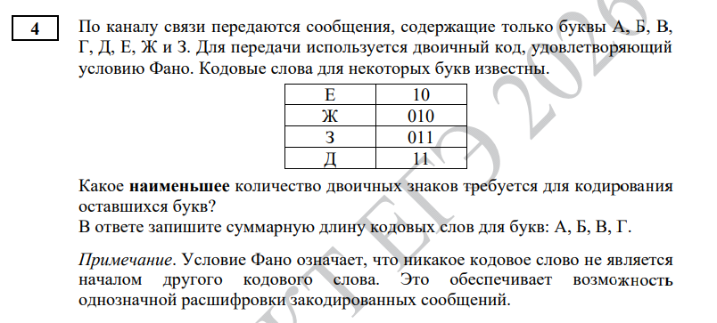

Решение всех подобных задач начинается с построения некой иерархической структуры, именуемой бинарным деревом. 
Правила построения довольно просты:

1. Из корня выходит 2 ребра, влево с весом 0, вправо с весом 1.
2. Из каждой вершины ребра выходят также, как и в п.1.
3. Если код вершины соответствует определенному символу - вершина не имеет потомков. 

Построим дерево для известных по условию кодов.

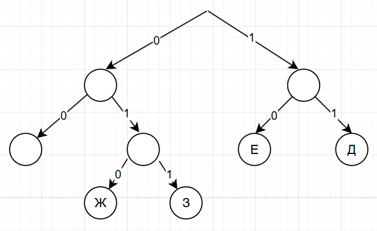

Как видно, у нас есть одна свободная безымянная вершина с кодом 00. Если бы нам требовалось выбрать минимальный код лишь для одной буквы, мы бы им и воспользовались, однако нам нужно выбрать коды для 4х букв (А, Б, В, Г), поэтому продолжим строить наше дерево. 

Когда в нашем дереве будет 4 безымянных листа (т.е. вершин, не имеющих исходящих путей и не занятых буквой), выделим им коды (при этом порядок абсолютно неважен).

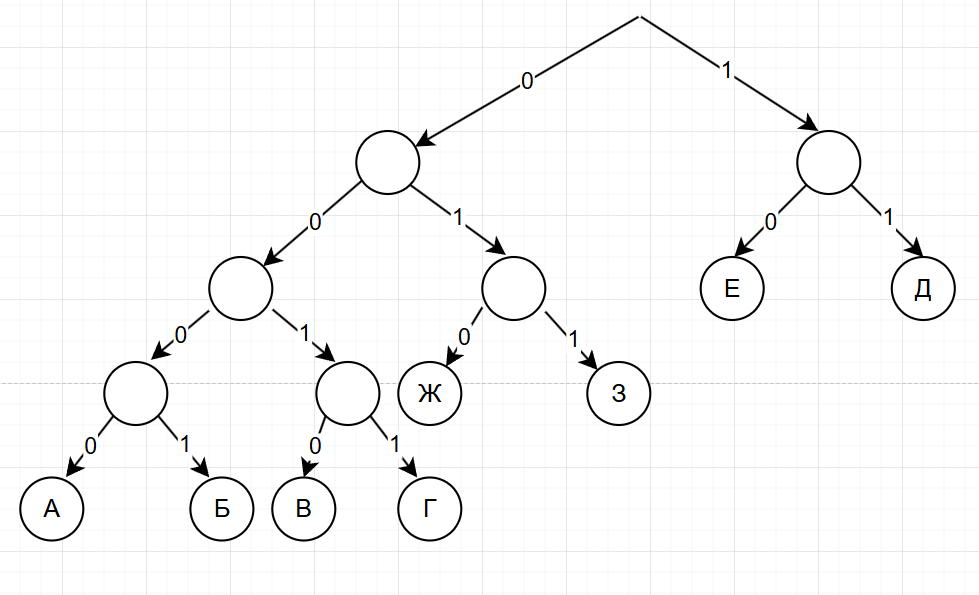

Как видно, коды всех 4х букв имеют длину 4 (0000, 0001, 0010, 0011), следовательно ответ на задачу $4+4+4+4 = 16$.

## На что обратить внимание
   Количество букв, которые может содержать сообщение по условию задачи. К примеру, вот 2 очень похожих условия:
   * По каналу связи передаются сообщения, содержащие только буквы А, Б, В. Для передачи используется двоичный код, удовлетворяющий условию Фано. Кодовые слова для некоторых букв известны. А - 00, Б - 01. Укажите кратчайшее кодовое слово для букв В.
   * По каналу связи передаются сообщения, содержащие буквы А, Б, В и остальные буквы русского алфавита. Для передачи используется двоичный код, удовлетворяющий условию Фано. Кодовые слова для некоторых букв известны. А - 00, Б - 01. Укажите кратчайшее кодовое слово для букв В.

В первом примере, у нас всего 3 буквы, а значит мы можем выбрать для буквы В код 1. Однако во втором примере мы так поступить уже не можем, потому что нам нужно оставить место для кодирования оставшихся букв алфавита, поэтому минимальный код для В - это 10. 

# <a id="task5">Задача 5 </a>

Задача на вычисление результатов работы простейших алгоритмов. Решается программированием. 

## Важно знать 

1. Перевод в двоичную СС:
```python
binN = bin(1505)[2:] 
```

2. Проверка на четность/нечетность:
```python
n = 10
if n % 2 == 0:
    print("Четное")
else:
    print("Нечетное")
```

3. Проверка кратности. Например кратно ли n трем:
```python
n = 10
if n % 3 == 0:
    print("Кратно 3")
else:
    print("Не кратно 3")
```

4. Посчитать остаток от деления n на 3:
```python
n = 10
print(n % 3)
```

5. Дописать '00' в конец (справа):
```python
binN = bin(1505)[2:] 
binN += '00'
```

6. Дописать '11' в начало (слева):
```python
binN = bin(1505)[2:] 
binN = '11' + binN
```

7. Заменить правые 2 разряда на '10':
```python
binN = bin(1505)[2:] 
binN = binN[:-2] + '10'
```

8. Заменить левые 2 разряда на '10':
```python
binN = bin(1505)[2:] 
binN = '10' + binN[2:]
```

9. Посчитать сумму цифр числа в двоичной СС (или же посчитать количество единиц):
```python
binN = bin(1505)[2:] 
print(binN.count('1'))
```

10. Функция перевода в троичную СС:

```python
def to3(n):
    res = []
    while n != 0:
        res.append(str(n % 3))
        n //= 3
    return ''.join(res[::-1])
```

## Решим задачу из демоверсии 2026

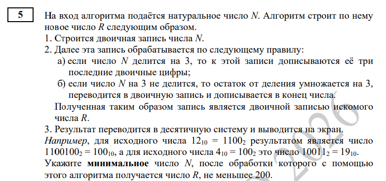

Напишем реализацию алгоритма

### Код
```python
def r(n):
    binN = bin(n)[2:]
    if n % 3 == 0: 
        binN += binN[-3:]
    else:
        binN += bin((n % 3) * 3)[2:]
    return binN

#вариант с for
for n in range(10 ** 7):
    if int(r(n), 2) >= 200:
        print(n)
        break

#вариант с while
n = 1
while int(r(n), 2) < 200:
    n += 1
print(n)
```

## На что обратить внимание

1. Оформляйте алгоритм получения нового числа R в отдельную функцию. После того, как напишите реализацию функции - протестируйте ее, для этого в условии задачи есть 2 примера, таким образом вы обезопасите себя от ошибок.

2. Как лучше в данном случае писать цикл, с for или while? Идеологически верно с while, так как цикл for используется, когда у нас есть определенный диапазон значений, а тут его нет. Фактически - пишите, как вам удобнее, но не забудьте выбрать достаточно большой диапазон.

3. Внимательно прочитайте условие, что именно требуется найти. N или R, максимальное или минимальное значение.
   
4. Внимательно прочитайте какое число дается по условию, целое или натуральное. Не забывайте, что натуральные числа начинаются с 1. 


# <a id="task6">Задача 6 </a>

Задание "на черепаху". В большинстве случаев для решения этой задачи нам необходимо нарисовать заданные алгоритмом фигуры и что-то посчитать.

## Решим задачу из демоверсии 2026

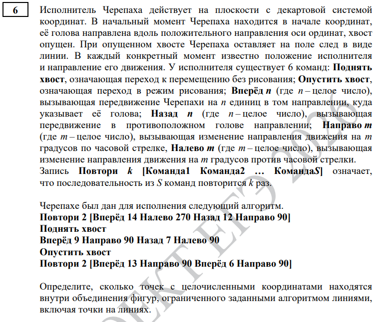

Реализовывать алгоритм будем на языке Python.

### Код
```python
#стартовая часть
from turtle import * #подключаем черепаху
tracer(0) #устанавливаем мгновенную отрисовку
screensize(5000, 5000) #задаем размер рабочей области
k = 20 #задаем коэффициент масштабирования
lt(90) #поворачиваем черепаху в исходное положение головой вверх

#реализация алгоритма движения
for _ in range(2): #2 повторения
    fd(14 * k) #вперед, можно использовать forward(14 * k)
    lt(270) #налево, можно использовать left(270)
    bk(12 * k) #назад, можно использовать back(12 * k)
    rt(90) #направо, можно использовать right(90)

up() #поднять хвост

fd(9 * k)
rt(90)
bk(7 * k)
lt(90)

down() #опустить хвост

for _ in range(2):
    fd(13 * k)
    rt(90)
    fd(6 * k)
    rt(90)

#отрисовка точек
up()
for x in range(-30, 30): #диапазоны берем эмпирически, если не хватает - расширяем
    for y in range(-30, 30):
        goto(x * k, y * k) #переходим к нужной точке
        dot(5, "red") #рисуем точку красного цвета размером 5

update() #обновляем окно
done() #не даем окну закрыться раньше времени
```

Получившиеся фигуры

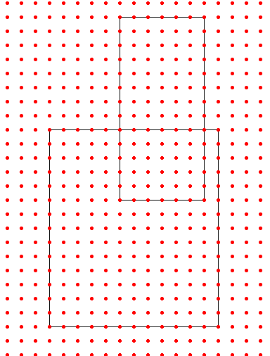

Считаем точки объединения фигур:

$15 * 13 + 7 * 8 = 251$

## На что обратить внимание 
1. Пересечение или объединение фигур требуется найти.
2. Учитывать ли точки на линиях или нет.

# <a id="task7">Задача 7 </a>
Задача на кодирование графических и аудио файлов, вычисление их размера, палитры цветов, разрешения, а так же характеристик, связанных с передачей их по сети (за сколько секунд произойдет передача или сколько файлов можно передать на n секунд и т.д.) Решается "руками".

## Решим задачу из демоверсии 2026 (вариант с графическим изображением) 

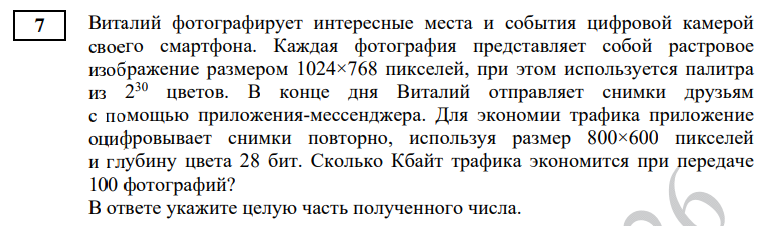

Для решения подобных задач нам нужна формула количества информации для графического изображения:

$I = h * w * i$,

где h - количество пикселей по высоте, w - количество пикселей по ширине и i - глубина, т.е. количество бит на пиксель.

Давайте остановимся подробнее на параметре i. Он показывает, сколько бит нам потребуется, чтобы закодировать 1 пиксель изображения. Эта величина зависит от нашей палитры - т.е. общего количества используемых цветов и определяется формулой

$N \leq 2^{i_{\text{min}}}$, 

где N - количество используемых цветов.

Разберем подробнее. Допустим у нас есть всего два цвета (например черный и белый), каким минимально возможным количеством бит мы можем закодировать один цвет? Двумя, например для черного цвета выберем код 0, для белого - 1. А если к нам добавится еще красный цвет? Тогда 1 бита нам не хватит и придется кодировать каждый цвет 2мя битами, например: 00, 01 и 10 (в отличие от случая из 4 задачи, тут мы не можем выбирать разную длину кодов, каждый цвет кодируется одинаковым числом бит). При этом у нас еще останется место для 4ого цвета (код 11), но если цветов будет 5, то нам потребуется уже 3 бита на один цвет и т.д. 

Именно это и отражено в формуле выше. Знак $\leq$, а не просто $=$ тут по той причине, что если число N - не является степенью 2ки, то и количество возможных кодов (их комбинаций) мы получаем с запасом. Например для N = 10, i = 4, $2 ^ 4 = 16$, т.е. остается место для еще 6 кодов. 

Вернемся к задаче. 
1. Найдем глубину цвета (бит на пиксель):
 
    $N = 2 ^ {30}$ => i == 30
2. Найдем размер исходного изображения:
   
   $I = 1024 * 768 * 30 = 23592960$ бит
3. Найдем размер сжатого изображения:
   
   $I = 800 * 600 * 28 = 13440000$ бит
4. Найдем экономию при передаче 1 файла:

   $dI = 23592960 - 13440000 = 10152960$ бит
5. Найдем экономию при передаче 100 файлов:

   $dI = 10152960 * 100 = 1015296000$ бит
6. Переведем биты в килобайты (1Кб = 1024 байт, 1 байт = 8 бит):
   
   $dI = 1015296000 / 8 / 1024 = 123937.5$
7. По условию задачи нужно отбросить дробную часть, итого ответ:
   
    $123937$

## Решим задачу из демоверсии 2026 (вариант со звуковым файлом)

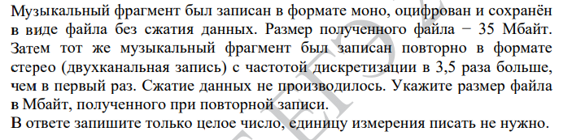

Для звуковых файлов воспользуемся формулой:

$I = F * i * t * k$ 

где
I - размер (объем) звукового файла в битах

F - частота дискретизации в герцах

t - длительность в секундах

k - количество каналов (1 для моно, 2 для стерео, 4 для квадро)

В данном случае, легко заметить, что размер итогового файла будет в 2 * 3.5 раз больше исходного (за счет увеличения количества каналов и частоты дискретизации), т.е. 35 * 2 * 3.5 = 245 Мбайт.

## На что обратить внимание
Единицы измерения. При этом важно помнить, что если в 1 Кб 1024 байт, то в 1 КГц не 1024 Гц, а 1000 Гц! 

# <a id="task8">Задача 8 </a>
Задача на комбинаторику. Обычно в этом типе задач нас просят перебрать комбинации определенной длины, состоящие из заранее известных символов (букв) и в зависимости от условия, найти нужную комбинацию или ее номер. Или же выяснить сколько чисел определенной системы счисления и определенной длины можно составить в зависимости от некоторого условия (например в числе нет повторяющихся цифр и т.д.).


## Важно знать 

1. Слово не может начинаться с буквы А:
```python
s = 'ШКОЛА'
if s[0] != 'А':
    print("Не начинается с буквы А")
```

2. Слово не может заканчиваться буквой А:
```python
s = 'ШКОЛА'
if s[-1] != 'А':
    print("Не заканчивается буквой А")
```

3. Слово не может начинаться с буквы А или Б:
```python
s = 'ШКОЛА'
if s[0] not in 'АБ':
    print("Первая буква - не А и не Б")
```

4. Слово содержит ровно 2 буквы А:
```python
s = 'ШКОЛА'
if s.count('А') == 2:
    print("В слове ровно 2 буквы А")

```

5. Слово может состоять из букв Ш, К, О, Л, А. Как определить, что оно не оканчивается на гласную:
```python
s = 'ШКОЛА'
if s[-1] not in 'АО':
    print("Не оканчивается на гласную")
```

6. В слове буквы А не могут стоять рядом:
```python
s = 'ШКОЛА'
if s.count('АА') == 0:
    print("Две буквы А не стоят рядом")
```

7. В слове все цифры (или буквы) различны (т.е. встречаются ровно 1 раз):
```python
s = '1505'
if len(s) == len(set(s)):
    print("Все цифры различны")
```

8. Не начинается с нечетной цифры:
```python
s = '1505'
if s[0] not in '13579':
    print("Первая цифра - четная")
```

9.  Дано число в двенадцатеричной СС. Нужно проверить, что оно имеет не менее двух цифр с числовым значением больше 9:
```python
alf = '0123456789ab'
s = '1505'
if s.count('a') + s.count('b') >= 2:
    print("Хотя бы 2 цифры числа больше 9")
```

10.  Никакие 2 нечетные цифры не стоят рядом:
```python
s = '1505'
s1 = s.replace('1', '*').replace('3', '*').replace('5', '*').replace('7', '*').replace('9', '*')
if s1.count('**') == 0:
    print("Двух подряд нечетных цифр нет")
```

## Решим задание из демоверсии 2026

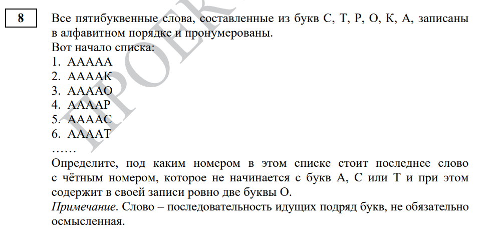

### Код

```python
alf = sorted("СТРОКА")
num = 0
res = 0
for s1 in alf:
    for s2 in alf:
        for s3 in alf:
            for s4 in alf:
                for s5 in alf:
                    s = s1 + s2 + s3 + s4 + s5
                    num += 1
                    if num % 2 == 0 and s[0] not in "АСТ" and s.count("О") == 2:
                        res = num
print(res)
```
### Разберем решение

1. Сначала мы определяем наш алфавит, т.е. символы, которые будем перебирать, записываем их в виде строки.
2. Применяем функцию sorted() для того, чтобы автоматически отсортировать буквы по алфавиту (в лексикографическом порядке) - АКОРСТ, если этого не сделать, то комбинации будут перебираться не по порядку и правильный ответ получить не удастся.
3. Объявляем переменные num (от number) и res (от result соотв), первая - порядковый номер текущей комбинации, начиная с 1, вторая - итоговый номер, который требуется найти по условию задачи.
4. Далее пишем столько циклов for, сколько символов в нашем слове. Раз у нас пятибуквенные слова, значит нужно 5 циклов for, каждый из них будет последовательно перебирать буквы на одной позиции (внешний цикл, самый первый, будет перебирать первую букву, следующий за ним вторую и т.д. от s1 до s5).
5. Затем собираем все буквы в единое слово с помощью операции склеивания: s = s1 + s2 + s3 + s4 + s5.
6. Увеличиваем текущий порядковый номер на 1.
7. Далее основная сложность задачи - верно написать условие выбора необходимого слова, если оно выполняется - записываем в переменную res номер текущего слова.
8. После того, как все циклы отработают - выводим на экран результат.

Этот же код можно написать более компактно, используя функцию product() модуля itertools. Первым аргументом передаем строку, содержащую наш алфавит, вторым аргументом - количество символов в слове (в нашей задаче пятибуквенные слова).

### Код
```python
from itertools import *
alf = sorted("СТРОКА")
num = 0
res = 0
for s in product(alf, repeat=5):
    num += 1
    if num % 2 == 0 and s[0] not in "АСТ" and s.count("О") == 2:
        res = num
print(res)
```

## Решим второй подтип

Определите количество шестеричных пятизначных чисел, в записи которых не менее двух цифр 5 и не более трёх нечетных цифр, меньших 4.


### Код
```python
alf = "012345"
cnt = 0
for n1 in alf:
    for n2 in alf:
        for n3 in alf:
            for n4 in alf:
                for n5 in alf:
                    n = n1 + n2 + n3 + n4 + n5
                    if n.count('5') >= 2 and n.count('1')+n.count('3') <= 3 and n[0] != '0': 
                       cnt += 1
print(cnt)
```

### Разберем решение
1. Записываем все цифры данной нам системы счисления (т.е. если бы по условию числа были бы в двенадцатеричной системе, то alf = '0123456789ab')
2. Далее все также как разбирали выше, кроме одной важной детали - чтобы число было строго пятизначным, оно не должно начинаться с нуля! Т.к. число 01234 - это по сути число 1234, т.е. четырехзначное, поэтому в нашу проверку мы добавляем n[0] != '0'!

## На что обратить внимание

1. Если в задаче просят найти под каким номером находится слово - не забыть использовать функцию sorted() при объявлении алфавита.

2. Если в задаче просят найти что-то связанное с числами, не забывать проверять, что первый символ строки не 0 (т.е. число 01234 является по факту четырехзначным, а не пяти).

# <a id="task9">Задача 9 </a>
Задача на электронные таблицы. Решать задачу можно двумя способами - через электронные таблицы и программированием. Второй способ чуть сложнее, но быстрее.

## Важно знать

1. В строке все числа различны:

```python
s = '42 1337 322 404'
l = [int(x) for x in line.split()]
if len(l) == len(set(l)):
    print("Все числа строки различны")
```

2. В строке одно число повторятся дважды, остальные различны:

```python
s = '1 5 0 5'
l = [int(x) for x in s.split()]
l1 = [x for x in l if l.count(x) == 2] # [5, 5]
if len(l1) == 2: 
    print("Одно число повторяется 2 раза, остальные различны")
```

3. Сумма минимального и максимального чисел строки меньше суммы остальных чисел:

```python
s = '42 1337 322 404'
l = sorted([int(x) for x in s.split()])
if l[0] + l[-1] > sum(l[1:-1]):
    print("Сумма мин и макс чисел больше суммы оставшихся")
```

4. В строке 5 чисел. 2 числа повторяются дважды. Определить, что наибольшее из повторяющихся чисел больше неповторяющегося:

```python
s = '42 1337 322 42 1337'
l = [int(x) for x in s.split()]
l1 = [x for x in l if l.count(x) > 1] # [42, 1337, 42, 1337]
l2 = [x for x in l if l.count(x) == 1] # [322]
if len(l1) == 4 and len(set(l1)) == 2 and max(l1) > l2[0]:
    print("Максимальное из повторяющихся чисел больше неповторяющегося")
```

5. 4 числа можно разбить на 2 пары с равными суммами:
```python
s = '1 2 3 4'
l = [int(x) for x in s.split()]
if (l[0] + l[1] == l[2] + l[3]) or (l[0] + l[2] == l[1] + l[3]) or (l[0] + l[3] == l[1] + l[2]):
    print("Можно разбить на 2 пары с равными суммами")
```


## Решим задание из демоверсии 2026

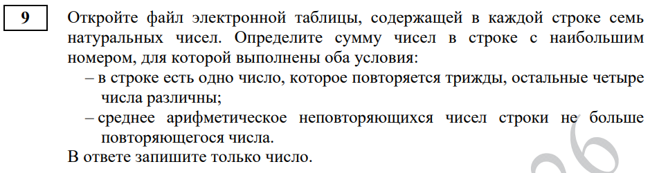

### Подготовка

1. Откроем предложенный файл в LibreOffice Calc (Excel не используем, так как на ЕГЭ его не будет).
2. Выделим все столбцы (мышью или через Ctrl+A).
3. Откроем Блокнот, вставим туда данные и сохраним файл с именем 9.txt.
4. Запустим IDLE, создадим новый файл и сохраним его в той же папке, что и 9.txt.
5. Напишем заготовку решения.

```python
for line in open("9.txt"):
    l = [int(x) for x in line.split()]
```

Т.е. мы открываем наш файл с данными и считываем его построчно, при этом каждую строку файла сохраняем в список l, переводя строки в числа, т.е. в l мы получим список чисел каждой строки.

Дальнейшее решение зависит от конкретного условия задачи. Для рассматриваемой задачи оно будет выглядеть так:

### Код
```python
res = 0
for line in open("9.txt"):
    l = [int(x) for x in line.split()]
    l1 = [x for x in l if l.count(x) == 3]
    s = set(l)

    if len(l1) == 3 and sum(s) / len(s) <= l1[0]:
        res = sum(l)
print(res)
```
## На что обратить внимание
Обязательно посмотрите, какие именно строчки ваши программа считает как подходящие под условие задачи. Т.е добавьте внутрь if вывод на экран текущей строки, которая прошла проверку и input(), чтобы можно было самим контролировать вывод каждой строки, т.е. 
```python
...
    if len(l1) == 3 and sum(s) / len(s) <= l1[0]:
        print(l)
        input()
...
```

# <a id="task10">Задача 10 </a>

Задача на поиск информации в текстовом документе. Единственная задача на работу с текстовым редактором.

## Алгоритм решения
1. Открываем файл в LibreOffice Writer.
2. Нажимаем справа на Навигатор.
3. Находим нужную нам часть/том/главу.
4. Нажимаем правый клик и выбираем Копировать (если такого пункта нет, то Выделить и копируем с помощью Ctrl + C).
5. Создаем новый документ (Ctrl + N или Файл -> Создать).
6. Нажимаем правый клик - вставить (или Ctrl + V).
7. Повторяем пункты 3-6, если таких глав несколько.
8. В новом документе нажимаем Ctrl + H или Правка -> Найти и заменить.
9. Указываем нужное нам слово или его часть.
10. В зависимости от условия задачи ставим галочки "Учитывать регистр" и "Слова целиком".
11. Нажимаем "Найти все". Результат появится либо в этом же окне, либо внизу страницы слева.

## Решим задачу из демоверсии 2026

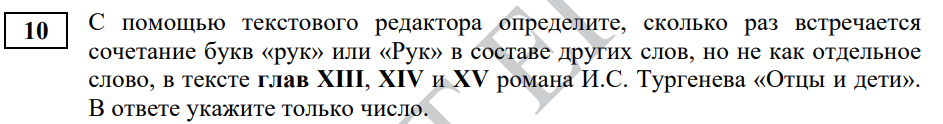

Откроем LibreOffice и панель "Навигатор".


Скопируем необходимые нам главы в новый документ.

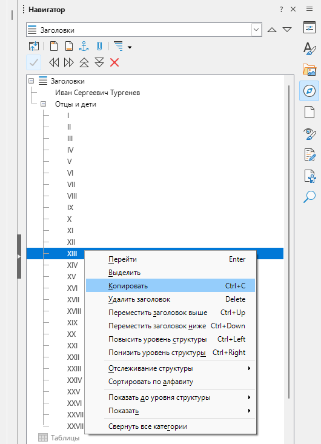

Проверим, что мы не ошиблись с копированием глав, в разделе Заголовки должны быть те же главы, что и в условии задачи. Затем введем нужное словосочетание, галочки "Учитывать регистр" и "Слова целиком" ставить не будем.

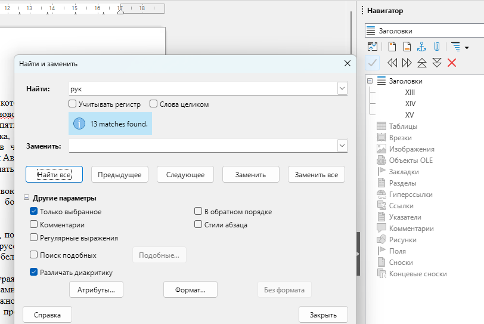

Чтобы убедиться, что мы нашли словосочетание только в составе других слов, а не как отдельное слово, пробуем найти искомое словосочетание в составе других слов и соответственно вычесть одного и другого. Таких слов нет, значит ответ на задачу $13 - 0 = 13$.

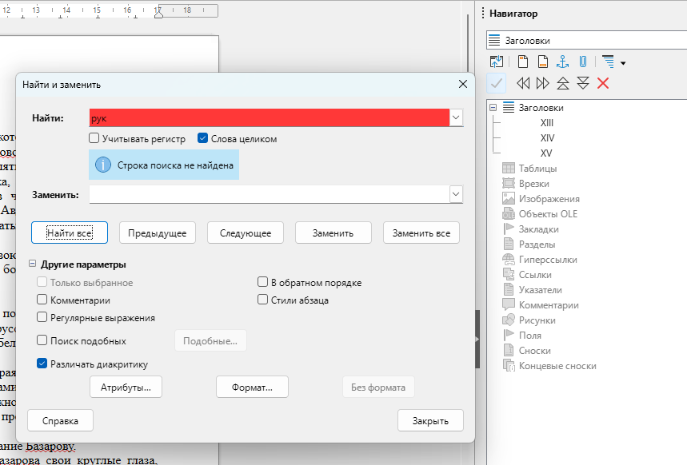

## На что обратить внимание
Слова через дефис LibreOffice считает как отдельные слова, т.е. в слове "как-нибудь", "как" будет считаться отдельным словом, а не частью слова. Чтобы не ошибиться в этом моменте, если по условию задачи требуется найти только слова целиком, то после подсчета нужно также подсчитать количество слов с дефисом и вычесть их. Например, если требуется найти количество слов "как", чтобы они были отдельными словами, то сначала ищем "как" c галочкой "Слова целиком", потом убираем эту галочку и ищем "как-", вычитаем и получаем правильный результат.

# <a id="task11">Задача 11 </a>
Задача на кодирование текстовой информации. Очень похожа на задачу № 7. Решается "руками".

Единственная необходимая для решения формула - это уже знакомая 
$N \leq 2^{i_{\text{min}}}$, 

при этом в данном контексте N - это мощность алфавита (т.е. количество символов, которое мы можем закодировать i-ым количеством бит). К примеру, один символ русского алфавита можно закодировать 6 битами, так как мощность алфавита N = 33 и соответственно $33 <= 2 ^ 6 (64)$ (5 не подходит, т.к. $2 ^ 5 = 32$).

## Решим задание из демоверсии 2026

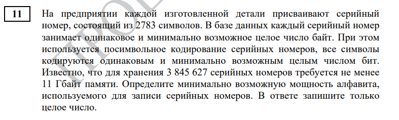

1. У нас есть количество серийных номеров и сколько требуется для их хранения (не менее 11 Гб). Найдем сколько байт требуется для хранения одного серийного номера.
    
    $11 * 1024 * 1024 * 1024 / 3845627 = 3071.3223263722666$. Округляем до 3072 байт (так как в условии задачи сказано, что не менее 11 Гб)

2. У нас есть длина одного серийного номера (2783) символа. Найдем сколько бит требуется для кодирования одного символа.

   $3072 * 8 / 2783 = 8.830758174631692$. Округляем до 9 бит

3. Найдем мощность алфавита (т.е. количество символов, которое мы можем закодировать 9 битами). Т.к. $2 ^ 8 = 256$, а $2 ^ 9 = 512$, получается, что 9 битами мы можем закодировать от 257 до 512 символов (включительно). По условию, нам требуется найти наименьшую мощность, значит правильный ответ: 257.

## На что обратить внимание
Вдуматься в формулировку, что 1 символ кодируется минимально возможным числом **бит**, а один серийный номер минимально возможным числом **байт**. Т.е. при расчетах важно вовремя переводить в нужные единицы измерения (в отличие от той же 7ой задачи, где можно было сразу посчитать итоговый ответ в битах и уже потом перевести в нужные по условию единицы измерения). При этом, когда мы округляем байты (т.е. сколько занимает один серийный номер), следует внимательно прочитать условие - если там написано, что все серийные номера занимают **более/не менее**, чем ... - значит округляем в большую сторону, если **не более/менее**, чем - в меньшую.

# <a id="task13">Задача 13 </a>

Задача на "сети". Решается как "руками", так и программированием.

## Важно знать

1. IP адрес - это 4 байта (числа в диапазоне [0;255], т.к 1 байт = 8 бит, следовательно диапазон возможных значений от 00000000 до 11111111 или же от 0 до 255 в десятичной СС), разделенные точкой. Пример: 192.168.1.2 Пример неправильных IP: 999.123.123.123, 123.d.123.123, 192.168.1

2. Сеть - некий диапазон IP адресов. Задается с помощью адреса сети и маски сети. 
   Пример: 192.168.0.0/255.255.0.0 или в короткой форме 192.168.0.0/16, где первая часть записи соответствует адресу сети, а вторая маске.
   
3. Адрес сети - первый IP адрес из диапазона всех IP адресов, входящих в данную сеть.

4. Маска сети - некий шаблон, с помощью которого можно отделить одну сеть от другой. 

    Это специальный IP адрес в записи которого сначала идут подряд 1, а потом 0. Те позиции, на которых стоят 1 в маске сети будут отвечать за адрес сети в IP адресе. 
    Пример: возьмем маску 255.255.255.0 или же в двоичной записи 

    11111111.11111111.11111111.00000000

    Данная маска говорит нам о том, что первые 24 бита в IP адресе отвечают за адрес сети, а последние 8 за адреса внутри сети. 

    Зная IP адрес и маску легко определить адрес сети. Формула: 
   
    **net = IP & mask**
    
     Т.е. мы переводим все адреса в двоичную СС и побитово умножаем на адрес маски.

    Таким образом для IP 192.168.1.1 с маской 255.255.255.0, адрес сети будет 192.168.1.0, а для IP 192.168.2.2 с той же маской - 192.168.2.0, из чего можно сделать вывод, что эти 2 адреса находятся в разных сетях.

    Теперь возьмем маску 255.255.0.0, тогда для IP 192.168.1.1 адрес сети будет 192.168.0.0, а для 192.168.2.2 - 192.168.0.0, т.е. теперь эти адреса будут принадлежать одной сети.

    Для более удобного записи маски можно записать только количество 1 в двоичной записи маски, т.е. для 255.255.255.0 - 24, а для 255.255.0.0 - 16, это называется короткой записью маски сети.

    Резюмируем, в данном примере

    192.168.1.1 и 192.168.2.2 - IP адреса 

    255.255.255.0 и 255.255.0.0 - маски сети

    192.168.0.0 192.168.1.0 192.168.2.0 - адреса сети

    192.168.0.0/255.255.0.0 или же 192.168.0.0/16 - сеть

1. Адреса устройств в сети. Важно понимать, что количество адресов в сети неравно количеству адресов, которые можно назначить устройствам данной сети, так как первый и последний адреса - служебные. Первый - собственно, адрес сети, последний - широковещательный адрес (он используется для того, чтобы отправить пакет сразу на все устройства в сети, вместо того, чтобы отправлять пакет на каждый адрес внутри сети, пакет отправляется на широковещательный адрес).
Пример: возьмем сеть 192.168.1.0/24, количество адресов в ней - 256, от 192.168.1.0 до 192.168.1.255, однако устройствам мы можем назначить лишь 256 - 2 = 254 адреса.


## Решим задачу на определение значений маски сети
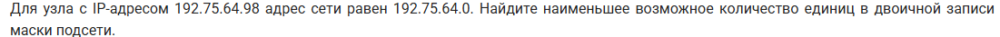

### Решение "руками"

Для решения "руками" нам нужно перевести все адреса в двоичную СС, при этом не забыть о том, то мы оперируем байтами, т.е. при переводе мы должны получить ровно 8 символов для каждого байта адреса, заполнив недостаток ведущими нулями. Например, для IP адреса 1.2.3.4 правильная запись будет

00000001.00000010.00000011.00000100

С учетом этой особенности, для перевода удобно использовать следующую запись в python:

```python
#перевод IP 192.168.1.1 в двоичную СС
print(".".join(f"{x:>08b}" for x in [192, 168, 1, 1]))
```

В данной задаче нам дан IP адрес и адрес сети. У нас есть формула: IP & mask = net. Выведем имеющиеся адреса в двоичной СС:

```python
print(".".join(f"{x:>08b}" for x in [192, 75, 64, 98])) #ip
print() #mask
print(".".join(f"{x:>08b}" for x in [192, 75, 64, 0])) #net
```

Получаем следующий вывод:

```python
11000000.01001011.01000000.01100010
11000000.01001011.01000000.00000000
```

Так как в маске сети сначала идут 1, а потом 0, то мы будем сравнивать соответствующие пары битов IP и сети, а именно искать следующие соответствия:

1. Смотрим слева направо и ищем пару, где в адресе IP установлен бит 1, а в адресе сети 0, так как это будет означать, что в соответствующем бите адреса маски может быть только 0, а **следовательно все биты правее него гарантировано будут 0!**

2. Смотрим справа налево и ищем пару, где в адресе IP установлен бит 1, и в адресе сети 1, так как это будет означать, что в соответствующем бите адреса маски может быть только 1, а **следовательно все биты левее него гарантировано будут 1!**

Заполним по этим правилам, неизвестные бит пометим "-":

```python
11000000.01001011.01000000.01100010
11111111.11111111.11------.-0000000
11000000.01001011.01000000.00000000
```

Неизвестные биты мы можем варьировать по своему желанию (не нарушая правил формирования маски, за 1 могут следовать лишь 0). Поскольку нас спрашивают о наименьшем возможном количестве единиц, значит мы можем поменять все "-" на 0 и соответственно ответом будет 18.

### Решение программированием

Для решения программированием мы будет использовать функцию ip_network() из модуля ipaddress. Важной особенностью этой функции является второй аргумент, если поставить его в значение 0 (или False) функция вернет нам сеть, основываясь на IP адресе устройства внутри сети и маске. 

```python
from ipaddress import *

for mask in range(33):
    net = ip_network(f"192.75.64.98/{mask}", 0)
    if str(net[0]) == "192.75.64.0":
        print(mask)
```

#### Разбор кода
После подключения модуля, мы перебираем все возможные значения маски (от 0 до 32 включительно), и для каждой из масок определяем сеть. Далее мы получаем адрес сети - это первый адрес из возможного диапазона адресов сети (net[0]), переводим его в строку, чтобы сравнить с адресом сети из условия задачи, если они совпали - значит выводим маску. Из всех значений выбираем минимальное (так как по условию требуется минимальное число единиц) - 18. 

## Решим задание на определение числа устройств в сети (из демоверсии 2026)

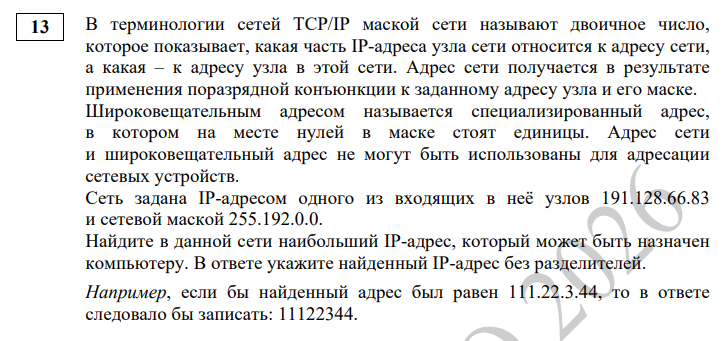

### Решение "руками"

1. Переведем адреса IP и маски в двоичную CC:
   
```python
print(".".join(f"{x:>08b}" for x in [191, 128, 66, 83]))
print(".".join(f"{x:>08b}" for x in [255, 192 ,0 ,0])) 
```
Получим следующий вывод:

```python
10111111.10000000.01000010.01010011
11111111.11000000.00000000.00000000
```

Далее, используя формулу net = IP & mask, перемножим соответствующие биты адресов, чтобы получить адрес сети:

```python
10111111.10000000.01000010.01010011
11111111.11000000.00000000.00000000
10111111.10000000.00000000.00000000
```

Так как маска содержит 10 единиц, это означает, что первые 10 бит IP адреса внутри определенной только что сети не могут меняться и строго зафиксированы как 10111111.10, все остальные же биты могут принимать значения 0 или 1, тем самым определяя диапазон всех возможных адресов внутри сети. Последний из таких адресов будет иметь вид:

10111111.10111111.11111111.11111111

Однако, последний адрес - это широковещательный адрес сети, поэтому мы не можем назначить его устройству, нам нужен предпоследний адрес или же:

10111111.10111111.11111111.11111110

Переведем обратно в десятичную СС и получим 191.191.255.254.

### Решение программированием 

В данном случае нам нет необходимости перебирать маску, поэтому мы сразу получаем нужную нам сеть и смотрим ее предпоследний адрес (последний мы использовать не можем - так как это широковещательный адрес сети)

```python
from ipaddress import *

net = ip_network("191.128.66.83/255.192.0.0", 0)
print(net[-2])
```

## Решим задачу на определение номера устройства в сети

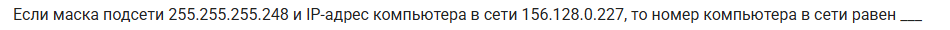

Определим сеть, а затем будем перебирать IP адреса внутри сети, пока не встретим нужный

```python
from ipaddress import *

net = ip_network("156.128.0.227/255.255.255.248", 0)
num = 0
for ip in net:
    if str(ip) == '156.128.0.227':
        print(num)
        break
    num += 1
```

Ответ: 3.

## Решим задачу на определение числа IP адресов внутри сети по определенному условию

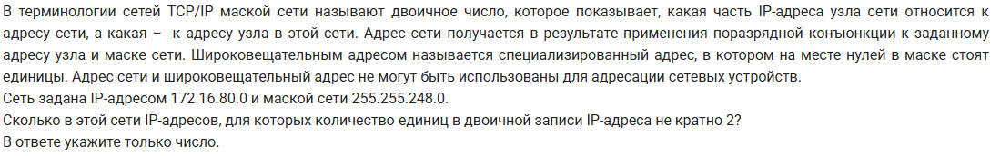

```python
from ipaddress import *

net = ip_network("172.16.80.0/255.255.248.0", 0)
k = 0
for ip in net:
    if bin(int(ip))[2:].count('1') % 2 != 0:
        k += 1
print(k)
```

В этой задаче есть важный нюанс, мы не можем перевести ip сразу в двоичную СС, bin(ip) выдаст ошибку, именно поэтому мы сначала переводим его в десятичную СС, а уже из нее в двоичную. 

## Решим задачу на случай 2х устройств в одной сети

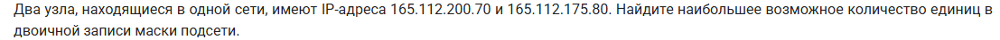

```python
from ipaddress import *
 
for mask in range(33):
    net1 = ip_network(f"165.112.200.70/{mask}", 0)
    net2 = ip_network(f"165.112.175.80/{mask}", 0)

    if net1 == net2:
        print(net1)
```

Далее останется выбрать сеть с максимальным количеством единиц в маске: 17.

## Решим задачу на случай 2х устройств в разных сетях

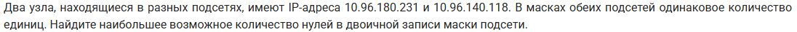

```python
from ipaddress import *
 
for mask in range(33):
    net1 = ip_network(f"10.96.180.231/{mask}", 0)
    net2 = ip_network(f"10.96.140.118/{mask}", 0)
    k1 = bin(int(net1.netmask))[2:].count('1')
    k2 = bin(int(net2.netmask))[2:].count('1')

    if net1 != net2 and k1 == k2:
        print(32 - k1)
```

В этой задаче для того, чтобы из сети выделить маску мы используем net2.netmask. Ответ: 13.

## На что обратить внимание

1. Не забывать, что количество адресов устройств - это количество всех адресов сети минус 2 (адрес сети и широковещательный, т.е. первый адрес из диапазона и последний).

2. Не забывать, что мы не можем применить функцию bin() напрямую к объекту ip адреса, только через int(): bin(int(ip))

3. В функции ip_network() вторым аргументом следует передать 0 (или False), если мы хотим определить адрес сети по ip адресу устройства внутри данной сети. 

4. Вывести полную форму маски можно используя net.netmask, а количество устройств сети net.num_addresses.

5. Объект сети (net) поддерживает индексацию. Так мы можем вывести первый адрес и последний, т.е. адрес сети и широковещательный:

```python
from ipaddress import *

net = ip_network('192.168.3.22/16', 0)

print(net[0]) #адрес сети - первый из доступного диапазона адресов сети
print(net[-1]) #широковещательный адрес - последний из доступного диапазона адресов сети
```


6. Проверить входит ли ip адрес в определенную сеть можно двумя способами, через создание объекта ip адреса и через приведение к строке и последующему сравнению строк:
   
```python
from ipaddress import *

ip_addr = ip_address('192.168.0.42')
net = ip_network('192.168.4.20/16', 0)

if ip_addr in net:
    print("Данный ip входит в данную сеть.")
```


```python
from ipaddress import *

ip_addr = '192.168.6.7'
net = ip_network('192.168.13.37/16', 0)

for ip in net:
    if str(ip) == str(ip_addr):
        print("Данный ip входит в данную сеть.")
```

# <a id="task14">Задача 14 </a>

В данной задаче нам нужно будет переводить числа в СС, отличные от 2, 8, 10 и 16. Для этого нам потребуется написать собственную функцию перевода числа n в СС с основанием x:

```python
def toX(n, x):
    res = []
    while n != 0:
        res.append(n % x)
        n //= x
    return res[::-1]
```

Важные особенности получившейся функции:

1. Она возвращает список, а не строку
2. Цифры, числовое значение которых больше 9 не заменяются буквами, а указываются значением в десятичной СС
   
Сравним вывод
```python
print(hex(1505))
print(toX(1505, 16))
```
Вывод:

0x5e1

[5, 14, 1]

Это сделано специально, поскольку в задачах этого типа обычно просят посчитать что-то (например количество цифр с числовыми значением больше 9) в получившимся числе

## Решим 1 задание из демоверсии 2026

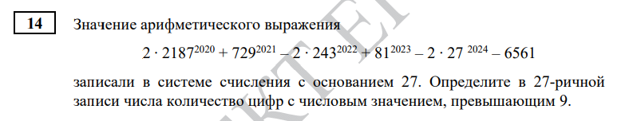

```python
def toX(n, x):
    res = []
    while n != 0:
        res.append(n % x)
        n //= x
    return res[::-1]

f = 2 * 2187**2020 + 729**2021 - 2 * 243**2022 + 81**2023 - 2 * 27**2024 - 6561
l = [x for x in toX(f, 27) if x > 9]

print(len(l))
```

## Решим 2 задание из демоверсии 2026

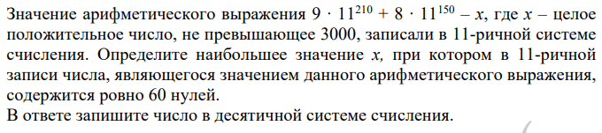

```python
def toX(n, x):
    res = []
    while n != 0:
        res.append(n % x)
        n //= x
    return res[::-1]

mx = 0 
for x in range(3000 + 1):
    f = 9 * 11**210 + 8 * 11**150 - x
    if toX(f, 11).count(0) == 60:
        mx = x

print(mx)
```

## Решим 3 задание из демоверсии 2026

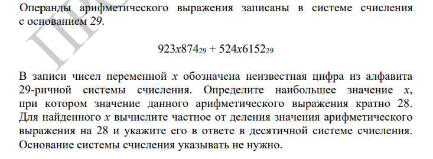

```python
from string import *

def toX(n, x):
    res = []
    while n != 0:
        res.append(n % x)
        n //= x
    return res[::-1]

alf = (digits + ascii_letters)[:29]
res = 0

for x in alf:
    n1 = '923'+x+'874'
    n2 = '524'+x+'6152'
    r = int(n1, 29) + int(n2, 29)
    if r % 28 == 0:
        res = r // 28

print(res)
```
## На что обратить внимание
Если в задаче основание системы счисления довольно велико (например 29) и требуется использовать много букв английского алфавита, это может оказаться проблемой, если вы вдруг его забудете. Есть 2 способа избавиться избежать этого.

1. Введите новую переменную, например alf и начинайте записывать в нее все печатные символы с клавиатуры, нажимая слева направо по очереди на каждую кнопку, начиная с q. Затем отсортируйте строку функцией sorted(), так вы получите английский алфавит в виде списка букв. Чтобы получить из него строку используйте ''.join().

```python
alf = ''.join(sorted('qwertyuiopasdfghjklzxcvbnm'))
```

2. Подключите модуль string и используйте в нем ascii_letters или ascii_lowercase.
   
```python
from string import *
print(ascii_letters, ascii_lowercase)
```

# <a id="task15">Задача 15 </a>
Задача на истинность логического выражения. Есть 4 основных подтипа. 3 из них решаются практически одинаковым шаблонным кодом, один решается "руками" или же чуть более хитрым кодом.

## Решим подтип 1. Побитовая конъюнкция (&)

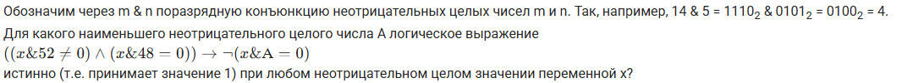

```python
def f(x, A):
    return (((x & 52)!= 0) and ((x & 48) == 0)) <= (not((x & A) == 0))

for A in range(1000):
    go = True
    for x in range(1000):
        if f(x, A) == 0:
            go = False
            break
    if go == True:
        print(A)
        break
```

### Разбор решения
1. Идея строится на полном переборе всех возможных x из эмпирически выбранного большого диапазона для каждого возможного значения параметра A. 
2. Как только хотя бы для одного из значений х результат функции оказывается ложным - переходим к новому значению А. 
3. Если мы перебрали весь диапазон и для каждого х функция оказалась истинной - такое А нам подходит, выводим его на экран.
4. Так как по условию задачи требуется найти минимальный А, мы пишем break - т.е. предотвращаем дальнейший перебор А. Если бы нужно было найти максимальное значение А, break писать не стоило бы.


Этот код можно упросить, избавившись от флага (переменной go). Достаточно вспомнить, что в python у нас есть возможность писать конструкцию else не только по отношению к if/elif, но также и к for/while:

```python
n = int(input())
for i in range(n):
    if i == 10:
        break
    print(i)
else:
    print("Этот текст выведется только если цикл закончится без break")
```

Таким образом, наш код можно упростить до
```python
def f(x, A):
    return (((x & 52)!= 0) and ((x & 48) == 0)) <= (not((x & A) == 0))

for A in range(1000):
    for x in range(1000):
        if f(x, A) == 0:
            break
    else:
        print(A)
        break
```

Однако код можно записать еще лаконичнее с использованием функции all():

```python
def f(x, A):
    return (((x & 52)!= 0) and ((x & 48) == 0)) <= (not((x & A) == 0))

for A in range(1000):
    if all(f(x, A) == 1 for x in range(1000)):
        print(A)
        break
```

## Решим подтип 2. Числовая плоскость

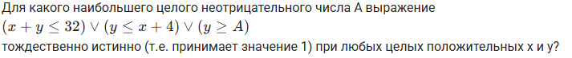

Отличие от предыдущей задачи только в том, что здесь мы перебираем не только x, но и у. Код получается довольно топорным, так как теперь мы не можем отказаться от переменной флага go:

```python
for A in range(1000):
    go = True
    for x in range(1000):
        if go == False:
            break
        for y in range(1000):
            if f(x, y, A) == 0:
                go = False
                break
    if go == True:
        print(A)
```

Поэтому лучше использовать вариант решения через функцию all():

```python
def f(x, y, A):
    return (x + y <= 32) or (y <= x + 4) or (y >= A)

for A in range(1000):
    if all(f(x, y, A) == 1 for x in range(1000) for y in range(1000)):
        print(A)
```

## Решим подтип 3. Функция

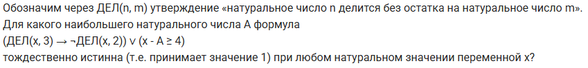

Решение этой задачи подобно решению первой задачи. Так как функция ДЕЛ() довольно простая - мы можем сразу записать ее реализацию внутрь функции f(). Однако для более сложных функция необходимо будет вынести ее реализацию в отдельную функцию.

```python
def f(x, A):
    return ((x % 3 == 0) <= (not((x % 2 == 0)))) or (x - A >= 4)

for A in range(1, 1000):
    go = True
    for x in range(1, 1000):
        if f(x, A) == 0:
            go = False
            break
    if go == True:
        print(A)
```

Или же 

```python
def f(x, A):
    return ((x % 3 == 0) <= (not((x % 2 == 0)))) or (x - A >= 4)

for A in range(1, 1000):
    for x in range(1, 1000):
        if f(x, A) == 0:
            break
    else:
        print(A)
```

Вариант решения с использованием all():
```python
def f(x, A):
    return ((x % 3 == 0) <= (not((x % 2 == 0)))) or (x - A >= 4)

for A in range(1, 1000):
    if all(f(x, A) == 1 for x in range(1, 1000)):
        print(A)
```

## Решим подтип 4. Отрезки

В данном подтипе сложность в том, что А - это не одно число, а отрезок. Задача хорошо решается "руками", хотя существует и программное решение.

### Ручное решение
Для ручного решения нам будет необходимо вспомнить основные законы алгебры логики.

| Название | x ∧ y | x ∨ y |
|---|---|---|
|Раскрытие импликации|x → y = ¬x ∨ y|
|Переместительный|x ∧ y = y ∧ x|x ∨ y = y ∨ x|
|Сочетательный|x ∧ (y ∧ z) = (x ∧ y) ∧ z|x ∨ (y ∨ z) = (x ∨ y) ∨ z|
|Распределительный|x ∨ (y ∧ z) = (x ∨ y) ∧ (x ∨ z)|x ∧ (y ∨ z) = (x ∧ y) ∨ (x ∧ z)|
|Законы де Моргана|¬(x ∧ y) = ¬x ∨ ¬y|¬(x ∨ y) = ¬x ∧ ¬y|
|Поглощения|x ∧ (x ∨ y) = x|x ∨ (x ∧ y) = x|
|Склеивания|(x ∨ y) ∧ (¬x ∨ y) = y|(x ∧ y) ∨ (¬x ∧ y) = y|
|Идемпотенции|x ∧ x = x| x ∨ x = x|
|Закон двойного отрицания|¬¬x = x|
|Закон противоречия|x ∧ ¬x = 0|
|Закон исключения третьего||x ∨ ¬x = 1|
|Действия с константами|x ∧ 0 = 0| x ∨ 0 = x|
|Действия с константами|x ∧ 1 = x| x ∨ 1 = 1|

Решим задачу из демоверсии 2026.


1. Первый шаг к решению задач этого типа - упростить выражение. Заменим для краткости x ∈ P на P и т.д. Далее раскроем скобки:

P → ((Q ∧ ¬A) → ¬P) = ¬P ∨ ((Q ∧ ¬A) → ¬P) = ¬P ∨ (¬(Q ∧ ¬A) ∨ ¬P) = ¬P ∨ (¬Q ∨ ¬¬A ∨ ¬P) = 
¬P ∨ ¬Q ∨ ¬¬A ∨ ¬P = ¬P ∨ ¬Q ∨ A ∨ ¬P = ¬P ∨ ¬Q ∨ A

2. Теперь нарисуем отрезки из условия на числовой прямой.

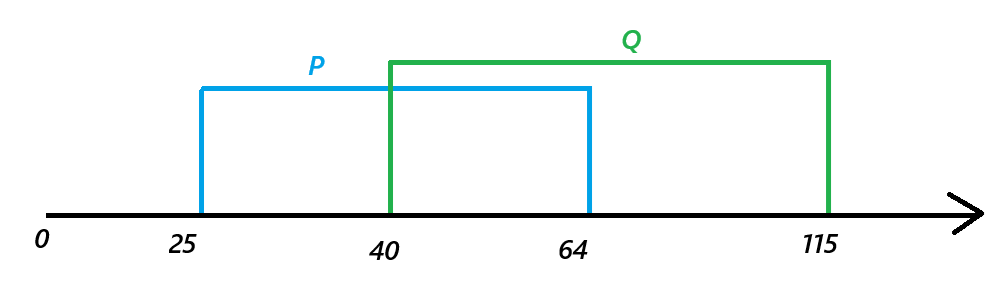

1. Итак, нам необходимо, чтобы наша функция (¬P ∨ ¬Q ∨ A) была истина при любом значении x. Это значит, что хотя бы одна из частей нашего логического выражения (¬P, ¬Q или же А) должна быть равна 1, т.е. x должен принадлежать этому отрезку. Закрасим схематично все подходящие x синим бирюзовым цветом для отрезка ¬P и зеленым для ¬Q.


4. Как видно, он осталась одна незакрашенная область [40;64]. Это и есть необходимый отрезок А. А его длина равна соответственно 64 - 40 = 24.


### Программное решение

Разобьем нашу числовую прямую на логические секции 1-5, разделенные точками в границах получившихся отрезков:

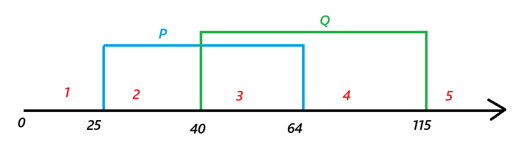

Идея решения строится на утверждении, что в каждой из этих логических секций, значение логического выражения не может меняться, и нам достаточно лишь проверить значения логического выражения в окрестностях точек границ отрезка (т.е. саму точку на границе, значение чуть меньше и значение чуть больше). Утверждение на первый взгляд может показаться неочевидным, но на самом деле является верным.

```python
def f(x):
    P = 25<=x<=64
    Q = 40<=x<=115
    A = a1<=x<=a2

    return P <= ((Q and (not A)) <= (not P))

points = []

for p in [25, 64, 40, 115]:
    points.append(p)
    points.append(p - 0.1)
    points.append(p + 0.1)

res = []
for a1 in points:
    for a2 in points:
        if a1 < a2 and all(f(x) == 1 for x in points):
            res.append(a2 - a1)
            
print(min(res))

```

#### Разбор решения
1. Сначала мы записываем функцию f(x), перенося саму функцию и границы отрезков из условия.
2. Формируем список точек, содержащий значения границ отрезков и по одной точке слева и справа от границ.
3. Перебираем все получившиеся точки, формируя из них различные отрезки и проверяем, истинна ли наша функция во всех точках получившего отрезка. 
4. Далее считаем длину подходящего отрезка и добавляем ее в список.
5. Выводим на экран минимальную длину из всех подходящих длин.
6. Следует учесть, что значения, которые выдает данная программа, необходимо округлять до ближайшего целого. 12.9 до 13, 13.1 до 13 и т.д.

## На что обратить внимание 
1. Внешним (первым) циклом необходимо перебирать значения параметра А, а уже потом х (и у по необходимости).
2. Внимательно следить за тем, какие значения могут принимать А, x, y. Натуральные, целые или неотрицательные. В задачах этого типа это может сильно влиять на итоговый результат.
3. Внимательно следить за тем, наибольшее или наименьшее значение требуется найти.
4. Внимательно переписывать функцию и ставить скобки, чтобы не нарушить приоритет выполнения логических операций.
5. При "ручном" решении подтипа на отрезки выучить основные законы алгебры логики.
6. При программном решении подтипа на отрезки не забывать округлять в случае дробного результата.

# <a id="task16">Задача 16 </a>
Задача на рекурсию. В зависимости от функции решается программно или "руками".

## Важно знать
Рекурсивной называется функция, которая вызывает саму себя. Рассмотрим простейшую рекурсивную функцию, которая подсчитывает факториал числа.

```python
def f(n):
    if n == 1: return 1
    return n * f(n - 1)

n = int(input())
print(f(n))
```
Разберем, как работает эта функция. 
1. Любая рекурсивная функция имеет т.н. "базу рекурсии" или же условие выхода. В данном случае мы указываем, что если нам поступит число 1 - мы вернем 1.
2. Если же нам поступило на вход число больше 1 (меньше не может по определению факториала числа), то мы заново вызываем нашу функцию, но со значением на 1 меньше.

Таким образом, если мы вызовем f(3), сначала вызовется f(3), она, в свою очередь, вызовет f(2), которая, в свою очередь, вызовет f(1). Т.е. в определенный момент времени в нашей оперативной памяти окажется 3 незавершенных вызова нашей функции (f(3), f(2), f(1)). А затем, они начнут завершаться, поскольку f(1) попадет в базу рекурсии и вернет результат (1) в ожидающую его функцию f(2), которая домножит его на 2 и вернет результат в ожидающую его функцию f(3), которая домножит его на 3 и вернет окончательный результат функции 3 * 2 * 1 = 6.

Итого, сначала мы порождаем все новые и новые вызовы функции с разными аргументами, пока не достигнем базы рекурсии, а затем в обратном порядке возвращаем получающиеся значения "наверх" (в ожидающие функции), завершая выполнение функций, пока не вернем значение в самую первую функцию и не получим итоговый результат.

### Плюсы и минусы
1. Плюсы - возможность писать красивый, понятный, лаконичный и компактный код.
2. Рост потребления оперативной памяти при большом количестве вызовов. 

К тому же, ситуация резко ухудшается, если мы используем не один, а сразу несколько рекурсивных вызовов в нашей функции. Приведем пример функции, которая выводит n-ый член ряда Фибоначчи. Т.е. это ряд, где f(n) = f(n-2) + f(n-1), где f(0) = 1 и f(1) = 1. Начало ряда выглядит так: 1 1 2 3 5 8 13 21.

Напишем реализацию:

```python
def fib(n):
    if n < 2: return 1
    return fib(n - 2) + fib(n - 1)

n = int(input())
print(fib(n))
```

А теперь давайте посмотрим на дерево вызовов нашей функции при n = 5:

 

Как можно заменить, мы не только кратно увеличиваем количество вызовов с ростом n, но и считаем одни и те же значения много раз! Таким образом, при хоть сколько-нибудь большом n, нашу программу ждет одно из двух: либо очень долгое время выполнения, либо ошибка, так как python позволяет создавать около 1000 рекурсивных вызовов. 

Как можно решить проблему?

1. Использовать нерекурсивный алгоритм. Так как любую рекурсивную функцию можно переписать в функцию без использования рекурсии.
2. Использовать кэширование промежуточных результатов, также известное как мемоизация, т.е. 
мы будем сохранять уже посчитанные значения и нам не придется считать много раз одно и то же.

### Вариант 1 (избавляемся от рекурсии)

```python
n = int(input())
l = [0] * (n + 1)
l[0] = 1
l[1] = 1 
for i in range(2, n + 1):
    l[i] = l[i - 2] + l[i - 1]
print(l[n])
```

### Вариант 2 (добавляем свое кэширование)

```python
cache = {}
def fib(n):
    if n < 2: return 1
    if n not in cache:
        cache[n] = fib(n - 2) + fib(n - 1)
    return cache[n]

n = int(input())
print(fib(n))
```

### Вариант 3 (добавляем встроенное кэширование)
В python уже есть механизм встроенного кэширования (декоратор @lru_cache()), поэтому нам нет нужды писать собственную реализацию.

```python
from functools import *

@lru_cache(None)
def fib(n):
    if n < 2: return 1
    return fib(n - 2) + fib(n - 1)

n = int(input())
print(fib(n))
```

Данный код решает все проблемы кроме одной: мы все еще можем упереться в ограничение по количеству вызовов (т.н. глубина рекурсии), хотя мы и существенно снизили количество вызовов благодаря кэшированию, при очень больших n (например 2000), нам все равно придется рекурсивно вызывать нашу функцию более 1000 раз. 

Для обхода этого ограничения, мы просто пройдемся циклом по значениям до нашего n и посчитаем значение функции, таким образом мы закэшируем значения функции для всех n, а так как каждый раз мы будем вызывать нашу функцию заново, глубина рекурсии расти не будет.

Итоговый вариант:
```python
from functools import *

@lru_cache(None)
def fib(n):
    if n < 2: return 1
    return fib(n - 2) + fib(n - 1)

n = int(input())
for i in range(n):
    fib(i)
print(fib(n))
```

### Вариант как делать **НЕ НАДО**

В интернете довольно популярно решение через простое увеличение максимальной глубины рекурсии в python с использованием функции setrecursionlimit():

```python
from sys import *

setrecursionlimit(10 ** 6)

def fib(n):
    if n < 2: return 1
    return fib(n - 2) + fib(n - 1)

n = int(input())
print(fib(n))
```

Вот почему такое решение не годится:
1. Искусственное расширение ограничения на глубину рекурсии не делает наш алгоритм более эффективным (в отличие от методов, рассмотренных выше). Из этого следует, что для больших значений время выполнения по-прежнему оказывается слишком велико.
2. Эта функция нестабильна, в некоторых случаях можно прождать довольно долго и по завершению работы алгоритма так и не увидеть результат.
   
## Решим задание из досрока 2024 года ("ручное" решение)

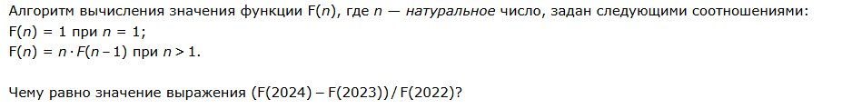 

Посмотрим внимательно на формулу из условия и попробуем выразить F(2024) и F(2023) через F(2022):

F(2024) = 2024 * F(2023)
F(2023) = 2023 * F(2022)

Подставим в итоговое выражение и подсчитаем результат:

(F(2024) - F(2023)) / F(2022) =  (2024 * F(2023) - 2023 * F(2022)) / F(2022) = (2024 * 2023 * F(2022) - 2023 * F(2022)) / F(2022) = 2024 * 2023 - 2023 = 2023 * 2023 = 4092529

## Решим задание из досрока 2026 года (программное решение)

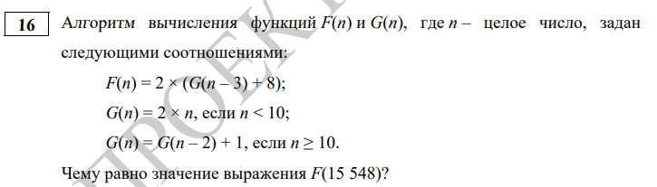 

```python
from functools import *

@lru_cache(None)
def f(n):
    return 2 * (g(n - 3) + 8)

@lru_cache(None)
def g(n):
    if n < 10: return 2 * n
    return g(n - 2) + 1

for i in range(15548):
    f(i)
    g(i)
    
print(f(15548))
```

### Комментарии к решению
1. Важно применять декоратор @lru_cache на все функции, результат работы которых мы хотим кэшировать. Точно также в цикле for мы вызываем все кэшируемые функции.
2. Иногда у нас может быть такая функция, где база рекурсии - большое значение, а сама рекуррентная формула считает значения для меньших n на основе бОльших n. Например, для n >= 0 дана функция: 

```python
def f(n):
    if n > 10 ** 6: return 1
    return f(n + 1) + f(n + 2)
```

В таком случае, в цикле for мы должны идти от большего значения к меньшему (от 10 ** 6 к 0 в данном случае), поскольку глубина рекурсии будет расти по мере уменьшения n (а не увеличения, как это было раньше)

### На что обратить внимание 
Итоговый алгоритм решения:
1. Смотрим на функцию из условия, можно ли ее упростить так, чтобы сразу получить ответ.
2. Если нет, то переписываем функцию как есть и запускаем.
3. Если получаем ошибку глубины рекурсии или же не видим ответ за несколько секунд - используем кэширование (мемоизацию) через @lru_cache.
4. Если забыли как использовать @lru_cache - реализуем свое кэширование или же решаем методом избавления от рекурсии. 

# <a id="task17">Задача 17</a>
Задача на перебор последовательности целых чисел по парам или по тройкам. Похожа на 9 номер. Решается программированием.

## Решим задание из досрока 2026 года

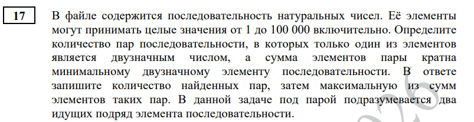

```python
l = [int(x) for x in open("DEMO_17.txt")]

m = min([x for x in l if 10 <= abs(x) <= 99])

res = []
for a, b in zip(l, l[1:]):
    if (10 <= abs(a) <= 99) + (10 <= abs(b) <= 99) == 1 and (a + b) % m == 0:
        res.append(a + b)

print(len(res), max(res))
```

# Разберем решение
1. Не забываем сохранять файл программы в ту же папку, что и файл с данными. Для этого используем File -> Save as. Текущий путь, куда сохранена программа, виден в самом верху IDLE (выше меню File, Edit, ...)
2. Формируем список чисел l из значений, указанных в файле
3. Находим минимальный двузначный элемент последовательности. Для этого очень удобно использовать генератор списков. Важный нюанс - в данной задаче мы могли бы обойтись без использования функции abs() - модуля числа, так как по условию задачи все числа в файле положительные. Однако так бывает не всегда. Поэтому либо внимательно читаем условие, либо просто приучаем себя использовать abs() по умолчанию в этом номере.
4. Определим список res - в него будем записывать подходящие нам суммы.
5. Перебираем список всех чисел по парам. Таким образом, для списка [1, 2, 3, 4, 5] цикл переберет пары (1,2), (2, 3), (3, 4), (4, 5).
6. Используем прием "сумма условий", без которого нам бы пришлось описывать очень громоздкое условие вида:
  
   ```python
   if ((10 <= abs(a) <= 99 and (abs(b) > 99 or abs(b) < 10)) or (10 <= abs(b) <= 99 and (abs(a) > 99 or abs(a) < 10)))
   ```
Разберем подробнее этот прием. Как известно, логические выражения дают в ответе либо True, либо False, т.е. истина или ложь. При переводе в число, True становится равным 1, а False 0 соответственно. Таким образом, сумма двух логических выражений может принимать значения: 0 (если оба ложны), 1 (если только одно истинно), 2 (если истины оба). Пример:

```python
x = 6
y = 7

print((x < 0) + (y < 0)) #0
print((x > 0) + (y < 0)) #1
print((x > 0) + (y > 0)) #2
```

Важный нюанс: все выражения должны быть заключены в скобки.

7. Таким образом, все подходящие суммы записываем в список res. Для ответа на задачу нам требуется количество элементов - len(res) и максимальная сумма - max(res)

Прием с zip() хоть и лаконичен, но может показаться неочевидным. Поэтому заменим его более привычными конструкциями.  

```python
l = [int(x) for x in open("DEMO_17.txt")]

m = min([x for x in l if 10 <= abs(x) <= 99])

res = []
for i in range(len(l) - 1):
    a = l[i]
    b = l[i+1]
    if (10 <= abs(a) <= 99) + (10 <= abs(b) <= 99) == 1 and (a + b) % m == 0:
        res.append(a + b)

print(len(res), max(res))
```

Ключевой момент - не забываем вычитать 1 в функции range(), а при увеличении количества перебираемых элементов (например для перебора тройки чисел), вычитать соответственно 2 (и более, при необходимости).

### На что обратить внимание 

1. Используем функцию определения модуля числа - abs(). Это критически важно при определении количества цифр в числе и последней цифры числа (попробуйте проверить результат -123 % 10). 
2. Используем прием "сумма условий", чтобы не писать чересчур длинные логические конструкции.
3. Не забываем заключать каждое логическое условие в скобки.

