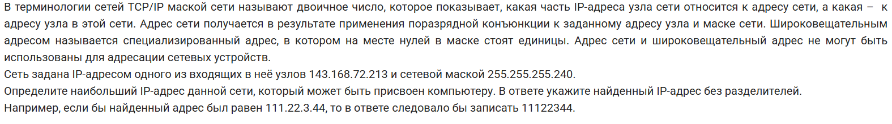
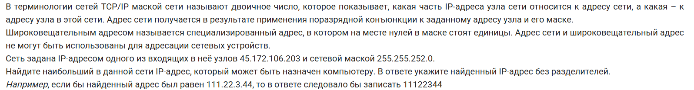
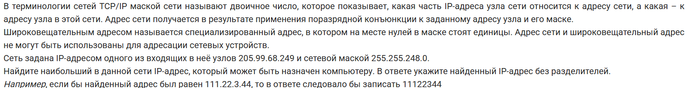
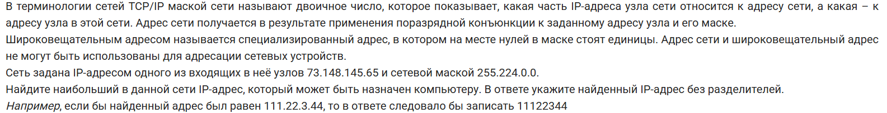
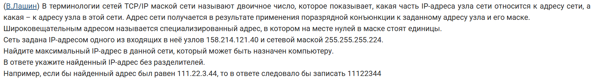
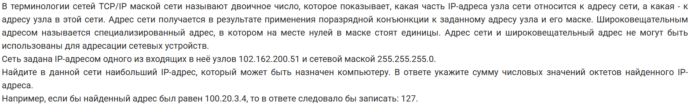
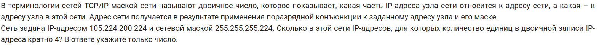
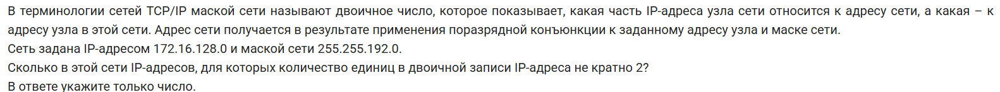
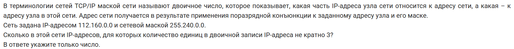
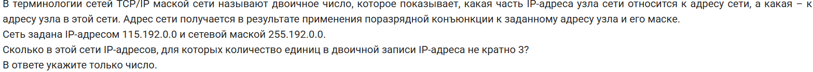

# Задача 13

1. Задача из досрока 2025
    
    

2. Задача из основной волны 2025 (10 июня)
    
    

3. Задача из основной волны 2025 (11 июня)
    
    

4. Задача из резервного дня 2025 (19 июня)
    
    

5. Задача из резервного дня 2025 (23 июня)
    
    

6. Задача из пересдачи 2025 (3 июля)
    
    

7. Задача из досрока 2024
    
    

8. Задача из основной волны 2024 (7 июня)
    
    

9. Задача из основной волны 2024 (8 июня)
    
    

10. Задача из основной волны 2024 (19 июня Сибирь)
    
    .png "Задача 13")

11. Задача из основной волны 2024 (19 июня Центр)
    
    .png "Задача 13")

12. Задача из основной волны 2024 (4 июля)
    
    

## Ответы

1. 14316872222
2. 45172107254
3. 2059971254
4. 73159255254
5. 15821412162
6. 718
7. 10
8. 8192
9. 699050
10. 24786
11. 215766
12. 2796202
