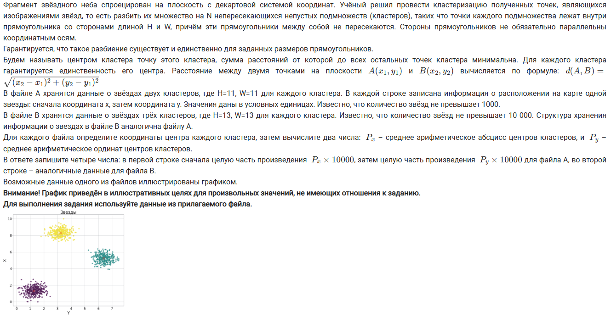
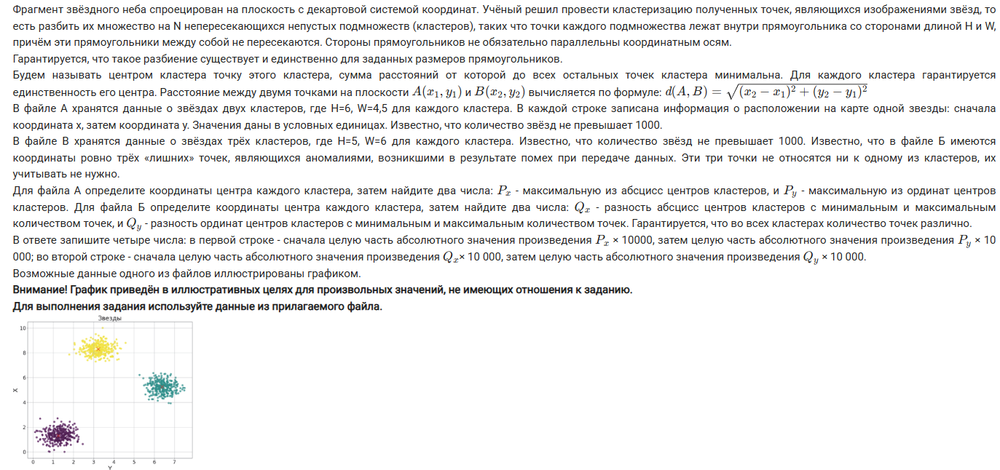
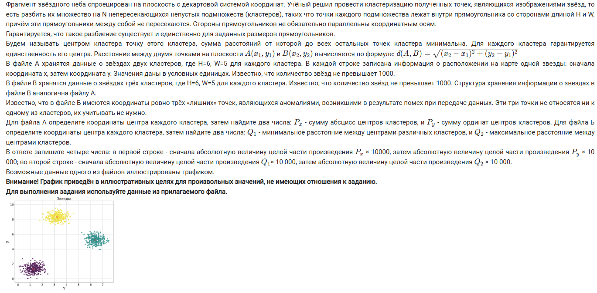
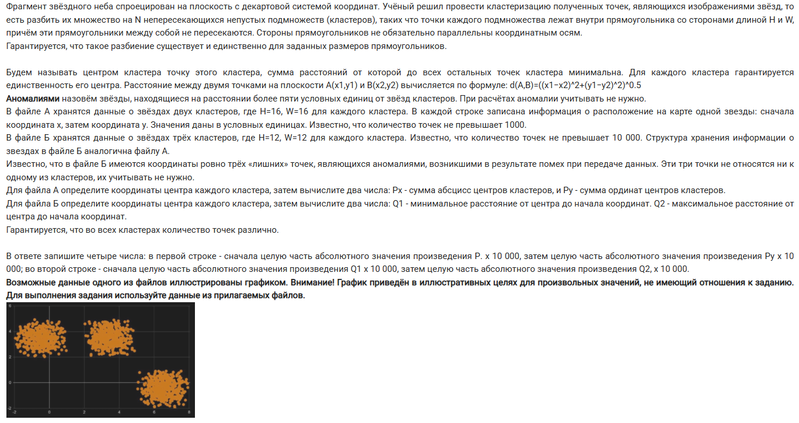
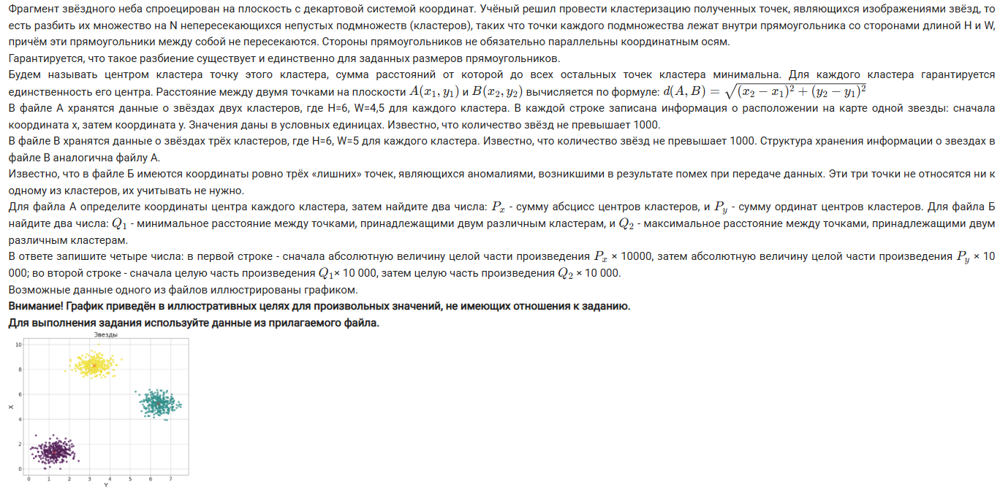

# Задача 27

1. Задача из досрока 2025
    
    

2. Задача из основной волны 2025 (10 июня)
    
    

3. Задача из основной волны 2025 (11 июня)
    
    

4. Задача из резервного дня 2025 (19 июня)
    
    

5. Задача из резервного дня 2025 (23 июня)
    
    

6. Задача из пересдачи 2025 (3 июля)
    
    

## Ответы

1. 167990 73043 122627 29105
2. 867 161306 69663 192156
3. 58778 151839 107002 323741
4. 110156 196632 224871 273226
5. 349898 471860 404241 1013671
6. 33863 170816 92256 258611

