# Задача 6

1. Задача из досрока 2025
    
    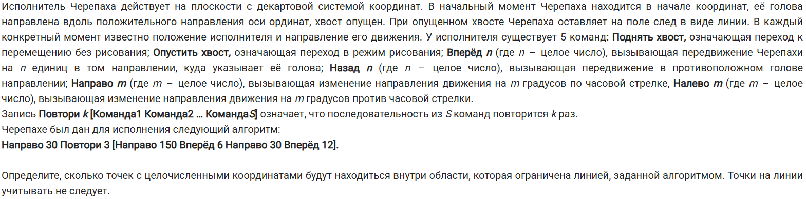

2. Задача из основной волны 2025 (10 июня)
    
    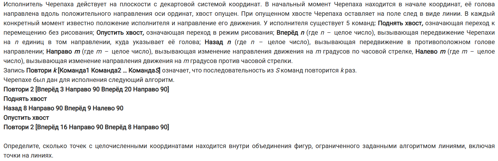

3. Задача из основной волны 2025 (11 июня)
    
    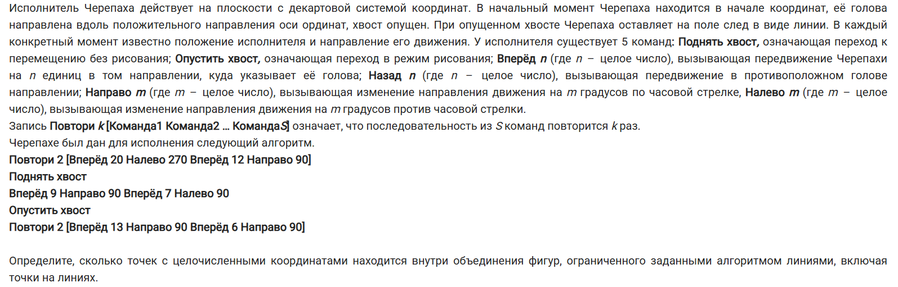

4. Задача из резервного дня 2025 (19 июня)
    
    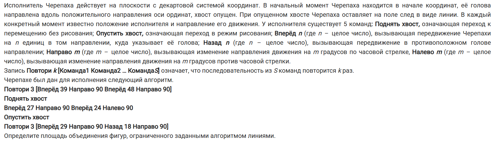

5. Задача из резервного дня 2025 (23 июня)
    
    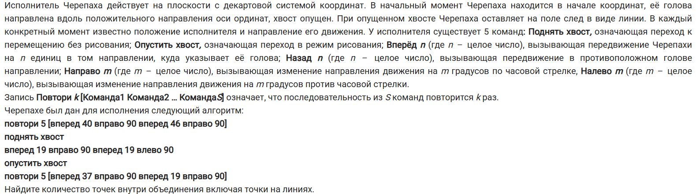

6. Задача из пересдачи 2025 (3 июля)
    
    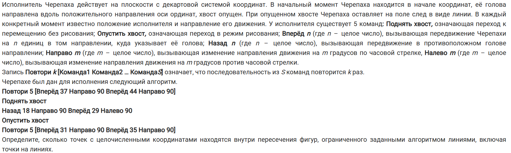

7. Задача из досрока 2024
    
    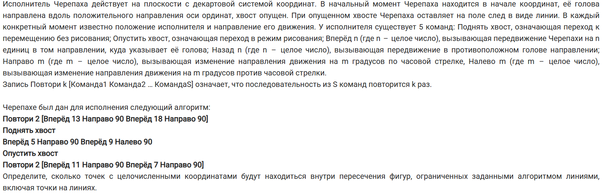

8. Задача из основной волны 2024 (7 июня)
    
    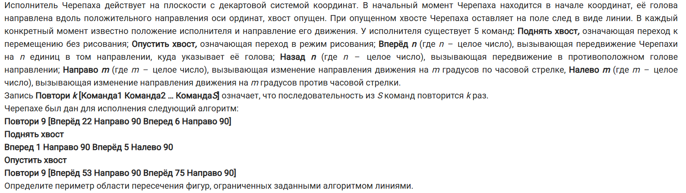

9. Задача из основной волны 2024 (8 июня)
    
    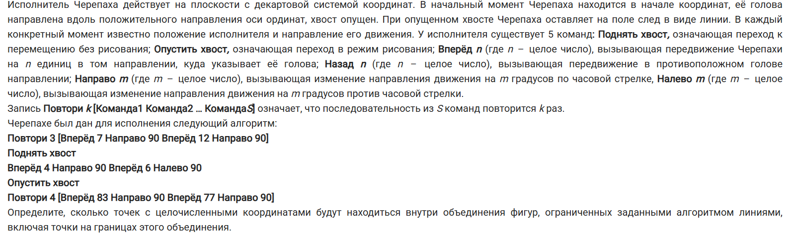

10. Задача из основной волны 2024 (19 июня Сибирь)
    
    .png "Задача 6")

11. Задача из основной волны 2024 (19 июня Центр)
    
    .png "Задача 6")

12. Задача из основной волны 2024 (4 июля)
    
    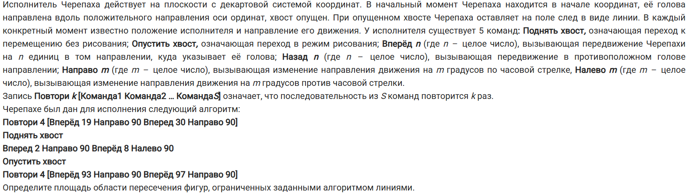

13. Задача из досрока 2023
    
    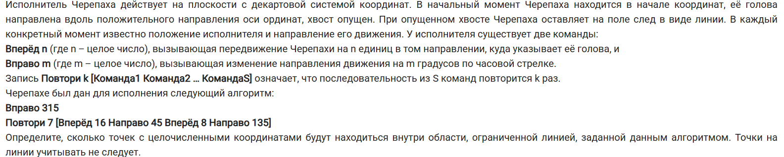

14. Задача из основной волны 2023
    
    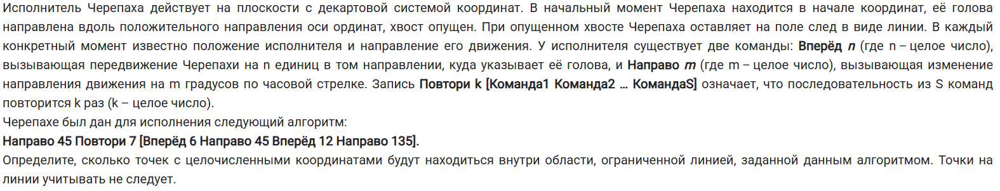

15. Задача из основной волны 2023
    
    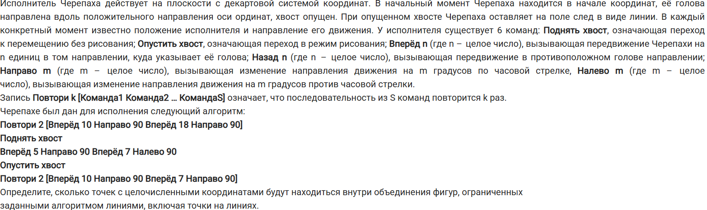

16. Задача из основной волны 2023
    
    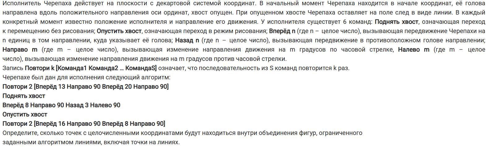

17. Задача из основной волны 2023
    
    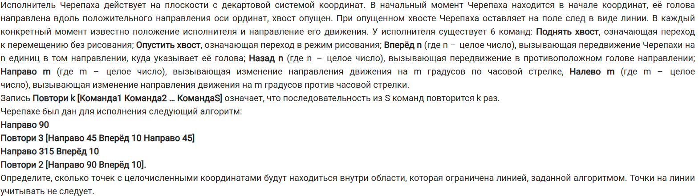

## Ответы

1. 30
2. 201
3. 299
4. 2178
5. 2247
6. 224
7. 72
8. 44
9. 6628
10. 28
11. 72
12. 374
13. 77
14. 44
15. 249
16. 411
17. 203